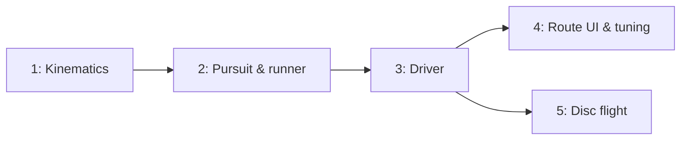

# Approach: fieldview-motion

## Strategy

Five partitions, split along the one seam that matters here: **pure physics versus everything that
touches time or the DOM**. Partitions 1 and 2 are mathematics with no clock, no store, and no React,
so they can be tested exhaustively and cheaply — which is the only way a model with a dozen
interacting tunables stays trustworthy. Partition 3 introduces the module's first free-running frame
loop and is where canon ADR-2 is at risk, so it ships alone with the Profiler assertion as its own
gate rather than buried inside a UI branch.

Partitions 4 and 5 are independent of each other and run in parallel. The disc flight touches
`disc.ts`, `throwMode`, and the throw completion path; the UI touches panels, the canvas, and
prefs. Disjoint files, disjoint failure modes.

The ordering is also a risk-management choice. The highest risk in this initiative is not a bug — it
is that the pursuit model is mathematically sound and still looks wrong to a coach. That verdict
cannot be reached until it can be watched and tuned, so the priority is reaching a runnable,
slider-tunable state as early as possible: Partition 4 lands the sliders in the same branch as the
first watchable run, deliberately, rather than shipping a demonstrable-but-unadjustable model.

No PRs at any boundary (matching the Builder's standing preference); every partition merges directly
into `initiative/fieldview-motion`, which merges directly to `main`.

## Partitions (Feature Branches)

### Partition 1: Kinematics → `feat/fieldview-motion-core`
**Modules**: `frontend/src/fieldview/motion/types.ts`, `motion/constants.ts`, `motion/vec.ts`, `motion/kinematics.ts`, `motion/route.ts`
**Scope**: The data model (`Mover`, `MotionState`, `Route`, `MotionParams`, `Trajectory`); every
motion tunable and slider range in one file; `Vec2` arithmetic; `arrive()` — vector accel-limited
steering with speed clamped to `vmax` and braking inside `v²/(2·decel)` on the final leg only; and
waypoint sequencing that rounds through intermediate legs at speed. No pursuit, no clock, no store.
**Dependencies**: None

#### Artifact Type
library

#### How to Run
- start: N/A — verify via `cd frontend && npm test -- kinematics route`

#### Acceptance Criteria
- [ ] A mover from rest reaches `vmax` in approximately `vmax / accel` seconds and no faster
- [ ] A mover arrives at a single destination and stops there — no overshoot, no oscillation around the target
- [ ] Braking begins within one step of the `v²/(2·decel)` threshold, not earlier or later
- [ ] A 90° direction change costs speed, and a straight run of the same distance is strictly faster than the two-leg version
- [ ] Intermediate waypoints are rounded through without stopping; only the final leg brakes
- [ ] Destinations outside the field are clamped consistently with existing drag clamping
- [ ] `motion/` declares no `vmax`, `react`, or flight-time constant of its own (tech-design ADR-3)
- [ ] All positions are model-space yards; no pixel, screen, or orientation concept appears anywhere in `motion/`

#### Implementation Steps
1. Write `types.ts` and `constants.ts` (defaults + slider ranges, one place only).
2. `vec.ts` with unit tests.
3. `arrive()` in `kinematics.ts`; test accel ramp, cruise, braking threshold, and arrival.
4. `route.ts` leg advance and arrival test; test the multi-leg turn-cost property.
5. Add `motionGuard.test.ts` (purity scan + no-duplicate-constants scan), mutation-tested.

---

### Partition 2: Pursuit & runner → `feat/fieldview-motion-pursuit`
**Modules**: `frontend/src/fieldview/motion/pursuit.ts`, `motion/step.ts`, `motion/simulate.ts`
**Scope**: The cushion model (tech-design ADR-2) — leverage along disc→cutter, cushion offset,
reaction served from a fixed-size ring; `step()` as the single physics entry point; `simulate()`
running the same stepper headlessly to settle with a hard ceiling, producing a `Trajectory`, plus
`sampleAt()` and `isSettled()`.
**Dependencies**: Requires Partition 1

#### Artifact Type
library

#### How to Run
- start: N/A — verify via `cd frontend && npm test -- pursuit simulate`

#### Acceptance Criteria
- [ ] A defender 10 yd deep of a cutter approaching the disc does **not** close on it — the gap narrows because the cutter closes it (PRD FR-3.2)
- [ ] When the cutter turns deep, the defender's speed downfield is increasing before the cutter reaches it (FR-3.4)
- [ ] Lateral cutter movement is matched within the cushion tolerance (FR-3.5)
- [ ] A two-leg cut yields strictly more separation at arrival than a one-leg cut to the same endpoint (the whole point of the initiative)
- [ ] The defender never exceeds `vmax` and never reverses direction instantly (FR-3.6)
- [ ] A `null` matchup defender does not move; a `null` possession falls back to `cushion = 0` without throwing
- [ ] `simulate()` terminates for randomised tunables across the full slider ranges — no combination oscillates past the ceiling
- [ ] Live-versus-headless agreement: stepping `n` times by `DT` equals `simulate()` sampled at `n · DT`, exactly
- [ ] No `Math.random` and no wall-clock read anywhere in `motion/`

#### Implementation Steps
1. `pursuit.ts`: reaction ring read/write, `cushionPoint()`, defender target.
2. `step.ts`: advance routed movers, then defenders, then the disc; one pass, no allocation.
3. `simulate.ts`: fixed-step loop, settle test, ceiling, sampling.
4. Property tests for termination across randomised tunables.
5. The live/headless agreement test — mutation-tested, since it is the guarantee Initiative D relies on.

---

### Partition 3: Driver → `feat/fieldview-motion-driver`
**Modules**: `frontend/src/fieldview/ui/motion/driver.ts`, `ui/motion/motionMode.ts`, `ui/motion/useMotionRun.ts`
**Scope**: The fixed-timestep accumulator with a clamped ceiling (tech-design ADR-5); rAF loop
writing one `store.mutate()` per rendered frame; `run`/`stop`/`reset` with pre-run positions saved;
transient motion state as a module-level external store (ADR-4); the reduced-motion path applying
`simulate()`'s end state in one mutation (ADR-6); React binding for status only.
**Dependencies**: Requires Partition 2

#### Artifact Type
library

#### How to Run
- start: N/A — verify via `cd frontend && npm test -- motionDriver` and `npm run test:perf`

#### Acceptance Criteria
- [ ] A 5-second frame gap produces bounded displacement, not a teleport (PRD FR-4.5)
- [ ] Exactly one `store.mutate()` per rendered frame regardless of substep count
- [ ] `stop()` freezes pieces exactly where they are; `reset()` restores pre-run positions exactly
- [ ] The run ends on its own when settled, and the status transitions accordingly
- [ ] Profiler records **0 React commits** across a full run, and the existing drag test still records 0
- [ ] With `prefers-reduced-motion`, `run()` applies the end state in a single mutation with no rAF loop
- [ ] Two drivers on two stores do not interfere (the seam Initiative D needs)
- [ ] Frame budget < 16 ms with 14 movers plus heatmap repaint, asserted in the quarantined `test:perf` suite
- [ ] `dispose()` cancels the rAF; no leak across mount/unmount cycles

#### Implementation Steps
1. `motionMode.ts` (routes, status, saved positions) on the `throwMode.ts` pattern.
2. `driver.ts` accumulator + clamp + rAF; store writes.
3. run/stop/reset semantics and the settle-driven end.
4. Reduced-motion branch.
5. Extend the Profiler test to cover a running simulation; add the perf assertion.

---

### Partition 4: Route UI & tuning → `feat/fieldview-motion-ui`
**Modules**: `frontend/src/fieldview/ui/shell/panels/OffensePlayerPanel.tsx`, `ui/FieldCanvas.tsx`, `render/routeLayer.tsx`, `render/tokens.ts`, `ui/AdvancedPanel.tsx`, `ui/prefs.ts`
**Scope**: The Route section in the offense panel (Set Destination / Add Waypoint / Clear / Run /
Stop / Reset, with the ux.md states and copy); destination picking in `FieldCanvas` with throwMode's
cancel grammar; drag suppression while running; `routeLayer` drawing the selected player's numbered
markers and legs; the Movement slider group in Advanced Settings; `MotionParams` persisted, validated,
and clamped in `prefs.ts`; the canvas running indicator; live-region announcements.
**Dependencies**: Requires Partition 3

#### Artifact Type
web-ui

#### How to Run
- start: `cd frontend && npm run dev`
- ready-check: `http://localhost:5173/fieldview` — select an offensive player, see a Route section
- teardown: `Ctrl+C`

#### Acceptance Criteria
- [ ] Select offence → Set Destination → click field → numbered marker appears and Run enables (ux.md Flow 1)
- [ ] Add Waypoint appends legs `2..n` with connecting lines; Clear removes the whole route
- [ ] Escape, re-clicking the armed button, selecting another player, or clicking a piece all cancel picking with no waypoint added (Flow 3)
- [ ] Only the selected player's route markers are drawn, though several players may hold routes and all run together
- [ ] Dragging a piece during a run does nothing; the canvas running indicator is visible
- [ ] Run disabled with `Set a destination first.` when no route exists
- [ ] Movement sliders change behaviour on the next run with no reload; reset-to-defaults works on the existing shared path
- [ ] Stored preferences lacking a `motion` key load with defaults; a hostile value is clamped, never producing NaN positions
- [ ] Controls render identically in the desktop sidebar and the mobile sheet (canon ADR-14)
- [ ] Live region announces run start, `Cut complete.`, and `Stopped.` — never per-frame positions
- [ ] Full fieldview suite green <!-- NEEDS MANUAL REVIEW: whether the pursuit looks right to a coach, and default tunable values, on the deployed preview -->

#### Implementation Steps
1. Route section in `OffensePlayerPanel` with all six ux.md states.
2. Destination picking in `FieldCanvas` + cancel paths; drag suppression while running.
3. `routeLayer.tsx` + tokens for markers, legs, and the running indicator.
4. Movement slider group in `AdvancedPanel`; `prefs.ts` persistence with validation and clamping.
5. Accessibility pass: announcements, `aria-pressed`, keyboard order, disabled reasons.

---

### Partition 5: Disc flight → `feat/fieldview-motion-disc`
**Modules**: `frontend/src/fieldview/motion/disc.ts`, `ui/shell/throwMode.ts`, `ui/FieldCanvas.tsx` (throw completion path), `render/pieceLayer.tsx`
**Scope**: `beginFlight()`/`discPos()` with duration from `space/layers.ts`'s `flightTime(d, hang)`
(tech-design ADR-3); the disc rendered from flight state while airborne; possession changing on
**arrival** via the existing `throwTo()`; the announcement moving to arrival; cancel/interrupt paths
that cannot orphan the disc.
**Dependencies**: Requires Partition 3 (needs the clock). Independent of Partition 4.

#### Artifact Type
web-ui

#### How to Run
- start: `cd frontend && npm run dev`
- ready-check: `http://localhost:5173/fieldview` — arm Throw, click a distant receiver, watch the disc travel
- teardown: `Ctrl+C`

#### Acceptance Criteria
- [ ] The disc travels rather than jumping; a 40 yd huck visibly takes longer than a 5 yd dump
- [ ] Flight duration equals `flightTime(d, hang)` and responds to the existing `hang` slider — `motion/disc.ts` computes no duration of its own
- [ ] Possession, roles, and the mark change on arrival, not on click, and the announcement matches what is on screen
- [ ] No state exists in which possession is neither the old holder's nor the new one's, including if a run is stopped mid-flight (PRD FR-5.4)
- [ ] Nobody renders as holding the disc while it is airborne
- [ ] With reduced motion, the throw resolves instantly, as today
- [ ] Existing `throwing.test.tsx` passes, adjusted only where arrival timing legitimately changed
- [ ] `space/` has zero diff; `spaceGuard.test.ts` passes <!-- NEEDS MANUAL REVIEW: throw feel on the deployed preview -->

#### Implementation Steps
1. `disc.ts` — flight construction and interpolation, duration delegated to `flightTime()`.
2. Wire flight into `step()`'s disc branch and the driver's completion callback.
3. Defer `throwTo()` and the announcement to arrival; render the disc from flight state.
4. Interrupt/cancel paths; assert the no-orphan invariant.

## Sequencing



### Partitions DAG

```yaml partitions
- name: feat/fieldview-motion-core
  modules: [motion/types.ts, motion/constants.ts, motion/vec.ts, motion/kinematics.ts, motion/route.ts]
  depends_on: []

- name: feat/fieldview-motion-pursuit
  modules: [motion/pursuit.ts, motion/step.ts, motion/simulate.ts]
  depends_on: [feat/fieldview-motion-core]

- name: feat/fieldview-motion-driver
  modules: [ui/motion/driver.ts, ui/motion/motionMode.ts, ui/motion/useMotionRun.ts]
  depends_on: [feat/fieldview-motion-pursuit]

- name: feat/fieldview-motion-ui
  modules: [ui/shell/panels/OffensePlayerPanel.tsx, ui/FieldCanvas.tsx, render/routeLayer.tsx, render/tokens.ts, ui/AdvancedPanel.tsx, ui/prefs.ts]
  depends_on: [feat/fieldview-motion-driver]

- name: feat/fieldview-motion-disc
  modules: [motion/disc.ts, ui/shell/throwMode.ts, ui/FieldCanvas.tsx, render/pieceLayer.tsx]
  depends_on: [feat/fieldview-motion-driver]
```

**Shared-file note**: Partitions 4 and 5 both touch `ui/FieldCanvas.tsx` — 4 adds destination
picking and drag suppression, 5 adjusts the throw completion path. Different regions of a 717-line
file, so the conflict risk is textual rather than semantic, but whichever merges second should expect
to resolve it by hand. Signal on merge.

## Migrations & Compat

No data migration. No format change, no `Scene` change. `fieldview.overlayPrefs` gains an optional
`motion` key — absent in every currently stored preference object, and handled by the same
fallback-and-clamp path the existing keys already use, so an existing user's stored preferences load
unchanged and are silently upgraded on next write.

Every existing play file, user preset, and test is unaffected by construction; zero semantic diff on
`scene/`, `play/`, and `space/` is a quality gate, not an expectation.

## Risks & Mitigations

| Risk | Mitigation |
|------|------------|
| The pursuit model is sound but looks wrong to a coach | Sliders land in the same partition as the first watchable run (P4), so calibration is a drag not a code change; defaults flagged `NEEDS MANUAL REVIEW` for the deployed preview |
| The free-running loop breaks canon ADR-2 | P3 ships alone with the extended Profiler assertion as its gate; the driver writes only through `store.mutate` and React sees status transitions only |
| Frame budget blown by per-substep repaints | One `mutate()` per rendered frame is an explicit acceptance criterion, not an implementation detail; perf assertion in the quarantined suite |
| A tuning combination oscillates or never settles | P2 property-tests termination across randomised tunables spanning the full slider ranges, plus a hard ceiling in `simulate()` |
| Motion redefines `vmax`/`react`/flight time, so heatmap and animation disagree | `motionGuard` fails the build on a duplicate constant (tech-design ADR-3); asserted in P1 and re-checked in P5 |
| Partitions 4 and 5 collide in `FieldCanvas.tsx` | Disjoint regions; signal on first merge and resolve by hand rather than pre-emptively splitting the file |
| Scope creeps into Initiative D via "the route should be saveable" | PRD FR-7.1 makes non-persistence a requirement; `Scene`/`PlayFile` zero-diff is a gate, and the panel states the deferral plainly rather than hiding it |
| The reduced-motion JS check is later "fixed" back to the CSS convention | Recorded as a deliberate exception in tech-design ADR-6 with the reason, and covered by a test |

## Alternatives Considered

- **Precomputed trajectories only** — rejected at kickoff: reactive pursuit still requires a stepper
  internally, so the design gains nothing and loses the ability to drive the model live.
- **Live tick simulation only** — rejected at kickoff: leaves Initiative D re-deriving motion or
  storing baked positions, and makes physics untestable without a fake clock.
- **A separate motion `vmax`** — rejected in tech-design ADR-3: two answers to "how fast can a player
  run", one of which the heatmap is already drawn from.
- **A new `SelectionState` kind for "routing"** — rejected: the union is closed with a complete panel
  registry (canon ADR-13), so a new kind is a compile error at every registry site, to express what
  is really a mode within an existing selection.
- **A new ribbon button for motion** — rejected in ux.md: the ribbon is a fixed 2×2 shared by both
  shells, and motion is a property of a selected player, not a global tool.
- **Variable timestep straight off rAF** — rejected in ADR-5: non-deterministic, so Initiative D
  could not replay a play, and a backgrounded tab would teleport everyone.
- **Persisting routes in a format v3** — rejected at kickoff: Initiative D redefines what a saved
  play is, and this would define the same idea twice.
- **Splitting P4 into panel / canvas / sliders** — rejected: a Route panel with no canvas picking is
  unusable, and a model you can watch but not tune is exactly the thing this initiative's main risk
  says to avoid shipping.
