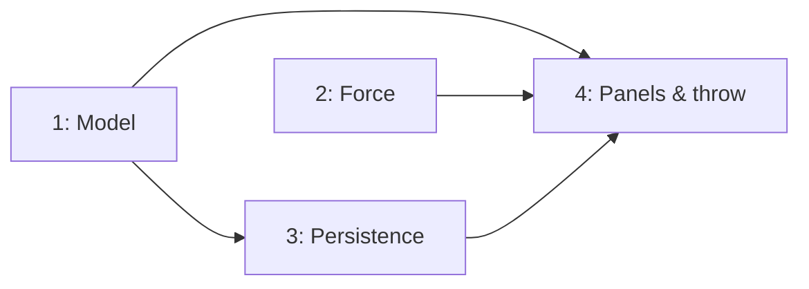

# Approach: fieldview-play-model

## Strategy

Four partitions, smaller than `fieldview-shell`'s six because there is no new layout to build —
the shell already exists and this initiative fills it. Model and Force have no dependency on each
other and start together. Persistence follows Model. The final partition lands all the UI and the
throw interaction together: a live Throw button without field click-handling is a broken mode, and
the mark panel is meaningless without Force, so shipping them as one reviewable unit is more honest
than three branches that are individually unusable.

No PRs at any boundary (matching the Builder's standing preference); every partition merges
directly into `initiative/fieldview-play-model`, which merges directly to `main`.

## Partitions (Feature Branches)

### Partition 1: Model → `feat/fieldview-play-model-core`
**Modules**: `frontend/src/fieldview/scene/types.ts`, `scene/possession.ts`, `scene/matchups.ts`, `scene/scene.ts`
**Scope**: `Scene.possession` + `Scene.matchups`; `normalize()` deriving `thrower`/`mark` roles
(tech-design ADR-1); `throwTo()`, `nearestDefender()`; `autoAssign()`, `reassign()` with 1-to-1
swap, `guardedBy()` (ADR-2). Existing `scene.ts` mutations end with `normalize()`.
**Dependencies**: None

#### Artifact Type
library

#### How to Run
- start: N/A — verify via `cd frontend && npm test -- possession matchups scene`

#### Acceptance Criteria
- [ ] `normalize()` makes the possessor the `thrower` and their assigned (else nearest) defender the `mark`; everyone else `cutter`/`defender` by team
- [ ] No sequence of public ops can produce a scene whose `thrower` is not the possessor (guard test)
- [ ] `reassign()` keeps matchups a permutation — no two defenders share a target — across arbitrary reassignment sequences
- [ ] `reassign(d, null)` clears only `d` and cascades nothing
- [ ] `throwTo()` moves possession, swaps roles, and reassigns the mark in one call
- [ ] `possession: null` yields no thrower and no mark, and does not throw
- [ ] All existing `scene/` tests pass unmodified

#### Implementation Steps
1. Add the two `Scene` fields; update every `Scene` construction site to supply them.
2. Write `possession.ts` (`normalize`, `throwTo`, `nearestDefender`) with unit tests.
3. Write `matchups.ts` (`autoAssign`, `reassign`, `guardedBy`) with permutation-property tests.
4. Call `normalize()` at the end of the existing `scene.ts` mutations; add the guard test.

---

### Partition 2: Force geometry → `feat/fieldview-play-model-force`
**Modules**: `frontend/src/fieldview/scene/force.ts`
**Scope**: `FORCE_PRESETS` (3 sides × 3 angles → yard offsets from the thrower), `markPosFor()`,
`readForce()` with `FORCE_TOLERANCE_YD`, returning a named force or `"custom"` (ADR-3). Pure
geometry — nothing stored, `space/` untouched.
**Dependencies**: None (reads a thrower position and a mark position; does not need possession)

#### Artifact Type
library

#### How to Run
- start: N/A — verify via `cd frontend && npm test -- force`

#### Acceptance Criteria
- [ ] `markPosFor(side, angle, throwerPos)` returns a distinct position for each of the 9 combinations
- [ ] `readForce()` round-trips: snapping to any preset then reading returns that same side/angle
- [ ] A mark displaced beyond `FORCE_TOLERANCE_YD` from every preset reads `"custom"`
- [ ] Offsets are field-relative yards, so readback is unaffected by the vertical render (canon ADR-11)
- [ ] `space/` has zero diff; `spaceGuard.test.ts` passes <!-- NEEDS MANUAL REVIEW: preset offsets are a first pass and want visual tuning -->

#### Implementation Steps
1. Define `FORCE_PRESETS` offsets and `FORCE_TOLERANCE_YD`.
2. Implement `markPosFor()` and `readForce()`.
3. Unit test each combination, the round-trip, and the custom threshold.

---

### Partition 3: Persistence → `feat/fieldview-play-model-format`
**Modules**: `frontend/src/fieldview/play/format.ts`, `play/validate.ts`, `play/serialize.ts`, `scene/presets.ts`
**Scope**: `PLAY_FORMAT_VERSION = 2`; optional `possession`/`matchups` on `PlayFile`; validation of
the new fields still dropping unknown keys; load-time backfill for v1 files and presets (ADR-4).
**Dependencies**: Requires Partition 1 (needs `autoAssign`/`normalize` to backfill with)

#### Artifact Type
library

#### How to Run
- start: N/A — verify via `cd frontend && npm test -- play presets`

#### Acceptance Criteria
- [ ] A v1 fixture (no possession/matchups) loads, is backfilled, and behaves identically to before
- [ ] All four built-in presets load with sensible auto-assigned matchups and a thrower with the disc
- [ ] A v2 file round-trips possession and matchups exactly
- [ ] Malformed new fields are ignored rather than rejecting the file
- [ ] Existing `play/` tests pass unmodified

#### Implementation Steps
1. Bump the version; add the optional fields to `PlayFile`.
2. Validate them, preserving the drop-unknown-keys rule.
3. Backfill on load in `serialize.ts`; route presets through the same path.
4. Add a v1 regression fixture.

---

### Partition 4: Panels & throw → `feat/fieldview-play-model-ui`
**Modules**: `frontend/src/fieldview/ui/shell/panels/`, `ui/shell/throwMode.ts`, `ui/shell/ToolRibbon.tsx`, `ui/FieldCanvas.tsx`, `render/pieceLayer.tsx`
**Scope**: The three placeholder panels become real (offense: possession + guarded-by; defense:
matchup selector + free roam + swap confirmation; mark: 3×3 force grid + custom readout). Throwing
mode (ADR-5) as shell UI state, the ribbon's Throw button made live, `FieldCanvas` click handling
and cancel paths, disc rendering from `possession`, and throwing-mode emphasis.
**Dependencies**: Requires Partitions 1, 2, and 3

#### Artifact Type
web-ui

#### How to Run
- start: `cd frontend && npm run dev`
- ready-check: `http://localhost:5173/fieldview` — select a defender, see a matchup selector
- teardown: `Ctrl+C`

#### Acceptance Criteria
- [ ] Clicking Throw arms the tool (`aria-pressed`), and clicking an offensive player completes a throw per UX Flow 1
- [ ] Escape, empty grass, a defender, or re-clicking Throw all cancel with no state change
- [ ] Throwing to the current holder is a no-op that exits the mode
- [ ] Throw is disabled with `Nobody has the disc.` when possession is null
- [ ] Defender panel shows and edits the matchup; reassignment visibly reports the swap
- [ ] Mark panel's 9 force buttons move the mark and the heatmap repaints; dragging the mark reads `Custom`
- [ ] Force controls are disabled with the no-thrower message when possession is null
- [ ] Panels render identically in the desktop sidebar and the mobile sheet (canon ADR-14)
- [ ] Profiler drag test still records 0 React commits
- [ ] Full fieldview suite green <!-- NEEDS MANUAL REVIEW: deployed-preview check of force positions and throw feel -->

#### Implementation Steps
1. `throwMode.ts` + live ribbon button.
2. `FieldCanvas` throwing-mode click/cancel handling; `pieceLayer` disc from possession + emphasis.
3. Defender panel (selector, free roam, swap confirmation).
4. Mark panel (force grid, custom readout, disabled state).
5. Offense panel (possession status, guarded-by).
6. Accessibility pass: live-region announcements for arming, throwing, and swaps.

## Sequencing



### Partitions DAG

```yaml partitions
- name: feat/fieldview-play-model-core
  modules: [scene/types.ts, scene/possession.ts, scene/matchups.ts, scene/scene.ts]
  depends_on: []

- name: feat/fieldview-play-model-force
  modules: [scene/force.ts]
  depends_on: []

- name: feat/fieldview-play-model-format
  modules: [play/format.ts, play/validate.ts, play/serialize.ts, scene/presets.ts]
  depends_on: [feat/fieldview-play-model-core]

- name: feat/fieldview-play-model-ui
  modules: [ui/shell/panels, ui/shell/throwMode.ts, ui/shell/ToolRibbon.tsx, ui/FieldCanvas.tsx, render/pieceLayer.tsx]
  depends_on: [feat/fieldview-play-model-core, feat/fieldview-play-model-force, feat/fieldview-play-model-format]
```

## Migrations & Compat

No data migration. `PlayFile` v1 files and all user presets in localStorage load unchanged and are
backfilled in memory (ADR-4). Nothing rewrites stored data on load, so a user who never saves keeps
a v1 file on disk indefinitely and it keeps working. `fieldview.overlayPrefs` is untouched.

## Risks & Mitigations

| Risk | Mitigation |
|------|------------|
| A mutation forgets to call `normalize()`, letting thrower and possession diverge — the exact bug canon's derived-disc rule prevented | Partition 1 ships a guard test asserting the invariant across every public op; reviewers check new mutations end with `normalize()` |
| Force quietly becomes stored state to make a panel simpler | ADR-3 forbids it; `spaceGuard` plus an explicit zero-diff check on `space/` at Partition 2 and again at Partition 4 |
| Swap logic degrades into duplicate coverage after many reassignments | Permutation-property tests over sequences, not just single reassignments |
| Partition 4 is large and lands a lot at once | Its six implementation steps are individually testable and committed separately; the acceptance list is per-behaviour, not per-file |
| Force preset offsets look wrong on screen | Flagged `NEEDS MANUAL REVIEW`; they are constants in one file, so correction is a token edit after the preview |

## Alternatives Considered

- **Storing force explicitly** — rejected in tech-design ADR-3: it creates a second answer to a
  question the space model already answers geometrically.
- **Keeping the disc derived and adding only matchups** — rejected: Initiative D must record a throw
  as a discrete event, which needs possession to be a fact, not an inference.
- **Splitting Partition 4 into panels / interaction** — rejected: the split lands a Throw button
  that arms nothing, or panels for a model with no way to change it. Neither half is reviewable.
- **Per-player matchup field instead of a Scene map** — rejected in ADR-2 (the invariant is a
  property of the set, not of any one player).
