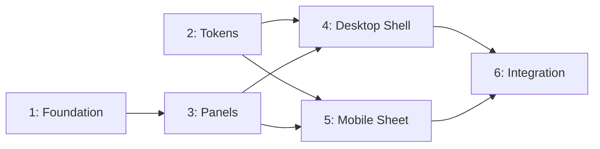

# Approach: fieldview-shell

## Strategy

Six partitions, mostly sequential with two parallel pairs. Foundation and Tokens have no
dependencies and can start immediately (and, per Builder preference, in separate worktrees).
Panels depends only on Foundation's selection types. Desktop and Mobile both consume the same
panel-registry data (tech-design ADR-4) and can be built in parallel once Panels + Tokens land.
Integration is the single point where everything is wired into `Whiteboard.tsx` and old components
are removed — it must be last so it isn't rebuilding on top of partitions still in flux.

No PRs at any boundary (Builder preference: "None") — every partition merges directly into
`initiative/fieldview-shell`, and the initiative merges directly into `main` at completion.

## Partitions (Feature Branches)

### Partition 1: Foundation → `feat/fieldview-shell-foundation`
**Modules**: `frontend/src/fieldview/scene/store.ts`, `frontend/src/fieldview/scene/selection.ts` (new), `frontend/src/fieldview/render/coords.ts`
**Scope**: Selection state added to `SceneStore` (ADR-1) with its own subscriber set; pure
`SelectionState` union + transition helpers in `scene/selection.ts`; orientation rotation added to
`render/coords.ts` (ADR-2), with `getStageViewBox` updated for the rotated dimensions.
**Dependencies**: None

#### Artifact Type
library (no standalone runnable surface — verified via unit tests and consumed by later partitions)

#### How to Run
- start: N/A — no persistent process; verify via `cd frontend && npm test -- selection coords`

#### Acceptance Criteria
- [ ] `scene/selection.ts` exports `SelectionState`, `selectPlayer`, `clearSelection`, `selectMarquee`, all pure and unit-tested
- [ ] `SceneStore` exposes `getSelection()`, `setSelection()`, `subscribeSelection()` additively — existing `getScene`/`mutate`/`subscribe`/`onFrame` signatures unchanged
- [ ] `render/coords.ts` renders offense attacking upward; existing `yardToPixel`/`pixelToYard`/`getStageViewBox` round-trip correctly under the new orientation (new unit tests) <!-- NEEDS MANUAL REVIEW: visual confirmation that "up" reads correctly on screen -->
- [ ] All existing `scene/` and `render/coords` tests still pass unmodified

#### Implementation Steps
1. Write `scene/selection.ts` with the `SelectionState` union and pure transition helpers; unit test each transition.
2. Add the selection field + `subscribeSelection` to `createSceneStore`; unit test that scene-subscribers and selection-subscribers fire independently.
3. Add the rotation to `coords.ts`; update `getStageViewBox` for swapped width/height; unit test round-trips.
4. Run the full existing fieldview test suite to confirm no regression in unrelated files.

---

### Partition 2: Design Tokens → `feat/fieldview-shell-tokens`
**Modules**: `frontend/src/fieldview/render/tokens.ts`, Tailwind config
**Scope**: `SHELL_TOKENS` (Light Film Room palette, zero-radius, JetBrains Mono / Archivo Black
typography) added to `render/tokens.ts` per ADR-6; Tailwind theme extended so shell components can
consume tokens via utility classes without inlining hex values.
**Dependencies**: None

#### Artifact Type
library

#### How to Run
- start: N/A — verify via `cd frontend && npm test -- tokensGuard`

#### Acceptance Criteria
- [ ] `SHELL_TOKENS` exports the accent (`#be185d`), grounds (`#ffffff`/`#f4f4f5`), border (`#d4d4d8`) — existing `FIELD_TOKENS`/`PIECE_TOKENS` (`#EF4B8A`, etc.) unmodified
- [ ] Tailwind theme exposes the shell palette and zero border-radius as first-class utilities (not ad-hoc arbitrary values scattered per component)
- [ ] `font-heading` utility maps to Archivo Black with no `font-bold` variant available on it (existing tweak's closed decision) <!-- NEEDS MANUAL REVIEW: visual check that the font renders correctly, not just that the class resolves -->
- [ ] Existing `tokensGuard.test.ts` still passes; extended to assert `SHELL_TOKENS` exists and `FIELD_TOKENS`/`PIECE_TOKENS` are untouched

#### Implementation Steps
1. Add `SHELL_TOKENS` to `render/tokens.ts`.
2. Extend Tailwind config/theme with the shell palette, zero-radius default, and font families.
3. Extend `tokensGuard.test.ts` to cover the new export.

---

### Partition 3: Panel Registry & Panels → `feat/fieldview-shell-panels`
**Modules**: `frontend/src/fieldview/ui/shell/panelRegistry.ts`, `frontend/src/fieldview/ui/shell/useSelection.ts`, `frontend/src/fieldview/ui/shell/panels/`
**Scope**: The typed panel registry (ADR-3); `useSelection` hook wrapping `useSyncExternalStore`;
five panel components — `DefaultVisibilityPanel` (migrated from `OverlayRail` visibility toggles),
`AdvancedSettingsPanel` (migrated from `AdvancedPanel`), and three placeholder panels
(`OffensePlayerPanel`, `DefensePlayerPanel`, `MarkPanel`) per UX copy samples.
**Dependencies**: Requires Partition 1 (selection types)

#### Artifact Type
library

#### How to Run
- start: N/A — verify via `cd frontend && npm test -- shell/panels shellGuard`

#### Acceptance Criteria
- [ ] `panelRegistry` has an entry for every `SelectionStateKind` (`shellGuard.test.ts`, per tech-design's testing pattern)
- [ ] `registerPanel()` allows overriding an entry and is exported for downstream initiatives
- [ ] `DefaultVisibilityPanel` reproduces existing `OverlayRail` offense/defense visibility toggle behavior (equivalent test coverage carried over)
- [ ] `AdvancedSettingsPanel` reproduces existing `AdvancedPanel` slider/config behavior
- [ ] Placeholder panels render the exact UX copy samples ("Matchup and mark controls ship in a future update.") and a dashed-border + tag treatment per UX UI States
- [ ] `useSelection()` returns the store's current selection and re-renders only on selection change, not on unrelated scene mutations

#### Implementation Steps
1. Build `panelRegistry.ts` + `useSelection.ts`.
2. Migrate `OverlayRail` visibility-toggle logic into `DefaultVisibilityPanel`.
3. Migrate `AdvancedPanel` into `AdvancedSettingsPanel`.
4. Build the three placeholder panels per UX copy.
5. Write `shellGuard.test.ts` asserting registry completeness.

---

### Partition 4: Desktop Shell → `feat/fieldview-shell-desktop`
**Modules**: `frontend/src/fieldview/ui/shell/ShellLayout.tsx`, `LeftSidebar.tsx`, `RightSidebarSlot.tsx`, `ToolRibbon.tsx`
**Scope**: Three-pane desktop grid (280px / fluid / 320px); top row-of-4 ribbon with disabled+tooltip
states for Throw to Player / Advanced Stats; bottom system menus (Advanced Settings slide-up, Play
Designer toggle); right sidebar slot with the Play Designer placeholder.
**Dependencies**: Requires Partition 2 (tokens) and Partition 3 (panel registry)

#### Artifact Type
web-ui

#### How to Run
- start: `cd frontend && npm run dev`
- ready-check: `http://localhost:5173/fieldview` renders the three-pane desktop shell at ≥1024px viewport
- teardown: `Ctrl+C`

#### Acceptance Criteria
- [ ] At ≥1024px, left sidebar (280px), canvas, and right slot (closed by default) render per the desktop mockup
- [ ] Clicking a player updates the middle section to the matching panel (per Partition 3's registry) without a full sidebar remount
- [ ] Throw to Player and Advanced Stats ribbon buttons are visibly disabled with a tooltip reading "Ships in a future update."
- [ ] Advanced Settings button slides a full-sidebar-override panel up, with a working "← Back"
- [ ] Play Designer button opens the right slot to the placeholder text with a working link to `/fieldview/designer`
- [ ] Keyboard navigation reaches every ribbon/toggle/menu button; disabled buttons are `aria-disabled` and still exposed for tooltip via focus <!-- NEEDS MANUAL REVIEW: screen reader spot-check -->

#### Implementation Steps
1. Build `ShellLayout.tsx` desktop grid and `ToolRibbon.tsx`.
2. Build `LeftSidebar.tsx` wiring `useSelection()` to `panelRegistry`.
3. Build `RightSidebarSlot.tsx` with open/close + placeholder content.
4. Wire Advanced Settings slide-up override state.
5. Accessibility pass: keyboard nav, `aria-live` on panel swap, `aria-disabled` ribbon buttons.

---

### Partition 5: Mobile Bottom Sheet → `feat/fieldview-shell-mobile`
**Modules**: `frontend/src/fieldview/ui/shell/BottomSheet.tsx`
**Scope**: Collapsed handle-bar (ribbon icons only) / expanded tabbed sheet (TOOLS / SELECTION /
SETTINGS) reading from the same `panelRegistry` + `useSelection()` as desktop; full-screen Play
Designer overlay variant (no 320px slot at phone width).
**Dependencies**: Requires Partition 2 (tokens) and Partition 3 (panel registry). Does not depend
on Partition 4 — both shells read the same registry independently.

#### Artifact Type
web-ui

#### How to Run
- start: `cd frontend && npm run dev`
- ready-check: `http://localhost:5173/fieldview` renders the collapsed bottom-sheet handle bar at a 390px-width viewport (browser dev-tools device emulation)
- teardown: `Ctrl+C`

#### Acceptance Criteria
- [ ] Below the shell breakpoint, field fills the viewport and the collapsed handle bar shows ribbon icons only, matching the mobile mockup
- [ ] Tapping the handle bar expands the sheet to ~46% height with TOOLS/SELECTION/SETTINGS tabs
- [ ] Selecting a player while the sheet is collapsed does not auto-expand it; a small indicator appears on the SELECTION tab position
- [ ] SELECTION tab shows "Select a player on the field to see options here." when nothing is selected, and the matching registry panel once something is
- [ ] Play Designer opens a full-screen overlay (not a slot) with the same placeholder copy as desktop
- [ ] `prefers-reduced-motion` disables the expand/collapse animation (instant show/hide)
- [ ] `SmallScreenNotice` component and its usage are fully removed; no viewport width blocks rendering

#### Implementation Steps
1. Build the collapsed handle bar.
2. Build the expanded sheet with tab switching, wired to `useSelection()` + `panelRegistry`.
3. Build the Play Designer full-screen overlay variant.
4. Remove `SmallScreenNotice.tsx` and its call site.
5. Add `prefers-reduced-motion` handling.

---

### Partition 6: Integration & Verification → `feat/fieldview-shell-integration`
**Modules**: `frontend/src/fieldview/pages/Whiteboard.tsx`, `frontend/src/fieldview/pages/FieldStage.tsx`, `frontend/src/fieldview/render/heatmap.ts`, `frontend/src/fieldview/render/exportImage.ts`, `frontend/src/fieldview/ui/OverlayRail.tsx` (removed), `frontend/src/fieldview/ui/AdvancedPanel.tsx` (removed), `frontend/src/fieldview/ui/PresetMenu.tsx` (relocated)
**Scope**: Wire `ShellLayout` into `Whiteboard.tsx`; remove `OverlayRail`/`AdvancedPanel`/
`SmallScreenNotice` (superseded); relocate `PresetMenu` into the shell's bottom-menu area; verify
`heatmap.ts`/`exportImage.ts`/`pick.ts` need no changes under rotated coordinates; extend the
Profiler-based drag test to cover a selection change mid-drag (ADR-1's regression test).
**Dependencies**: Requires Partition 4 and Partition 5

#### Artifact Type
web-ui

#### How to Run
- start: `cd frontend && npm run dev`
- ready-check: `http://localhost:5173/fieldview` — full whiteboard experience, desktop and mobile
- teardown: `Ctrl+C`

#### Acceptance Criteria
- [ ] `Whiteboard.tsx` renders through `ShellLayout`; no direct `OverlayRail`/`SmallScreenNotice` usage remains anywhere in the codebase
- [ ] PNG export (`exportImage.ts`) produces a correctly-oriented (vertical, offense-up) image
- [ ] Heatmap overlay paints correctly aligned to the rotated field in both mouse-drag and static states
- [ ] Extended Profiler test (0 React commits across 25 pointer moves, including one selection change) passes
- [ ] Full existing 229-test fieldview suite passes, plus all new tests from Partitions 1–5
- [ ] `PresetMenu` is reachable and functionally unchanged from its new location
- [ ] Deployed preview reviewed against the desktop and mobile mockups <!-- NEEDS MANUAL REVIEW: Builder + client sign-off per PRD Quality Gates -->

#### Implementation Steps
1. Wire `ShellLayout` into `Whiteboard.tsx`; delete superseded files.
2. Relocate `PresetMenu` into the bottom-menu area.
3. Manually verify `heatmap.ts`/`exportImage.ts` render correctly under rotation; patch only if a real bug surfaces (tech-design expects no logic change).
4. Extend the Profiler-based drag test.
5. Run full suite; fix any regressions.
6. Request a deployed preview for Builder/client review.

## Sequencing



### Partitions DAG

```yaml partitions
- name: feat/fieldview-shell-foundation
  modules: [scene/store.ts, scene/selection.ts, render/coords.ts]
  depends_on: []                    # parallel — will get a worktree

- name: feat/fieldview-shell-tokens
  modules: [render/tokens.ts, tailwind-config]
  depends_on: []                    # parallel — will get a worktree

- name: feat/fieldview-shell-panels
  modules: [ui/shell/panelRegistry.ts, ui/shell/useSelection.ts, ui/shell/panels]
  depends_on: [feat/fieldview-shell-foundation]

- name: feat/fieldview-shell-desktop
  modules: [ui/shell/ShellLayout.tsx, ui/shell/LeftSidebar.tsx, ui/shell/RightSidebarSlot.tsx, ui/shell/ToolRibbon.tsx]
  depends_on: [feat/fieldview-shell-tokens, feat/fieldview-shell-panels]

- name: feat/fieldview-shell-mobile
  modules: [ui/shell/BottomSheet.tsx]
  depends_on: [feat/fieldview-shell-tokens, feat/fieldview-shell-panels]

- name: feat/fieldview-shell-integration
  modules: [pages/Whiteboard.tsx, pages/FieldStage.tsx, render/heatmap.ts, render/exportImage.ts]
  depends_on: [feat/fieldview-shell-desktop, feat/fieldview-shell-mobile]
```

## Migrations & Compat

No data migrations — selection state is ephemeral and unpersisted; the play file format is
untouched. The `/field-view` → `/fieldview` redirect already shipped in the prior tweak and is
unaffected. No existing user-facing state (saved plays, presets, overlay prefs in localStorage) is
restructured; `PresetMenu` and overlay-prefs (`fieldview.overlayPrefs`) continue to read/write the
same localStorage keys, just from a new component location.

## Risks & Mitigations

| Risk | Mitigation |
|------|------------|
| Parallel Foundation/Tokens partitions drift from what Panels/Desktop/Mobile expect | Tech-design's interfaces (ADR-1, ADR-3, ADR-6) are specified before any partition starts; Panels/Desktop/Mobile branch from `initiative/fieldview-shell` only after Foundation+Tokens merge, not concurrently |
| Desktop and Mobile partitions both touch shared registry/hook code and diverge in how they call it | ADR-4 mandates identical `useSelection()` + `panelRegistry` calls; code review at each partition's completion checks for a second, ad-hoc data path |
| Integration partition discovers `heatmap.ts`/`exportImage.ts`/`pick.ts` actually do need orientation-specific changes, contrary to tech-design's "verify-only" expectation | Acceptance criteria in Partition 6 call this out explicitly; if a real change is needed, Reflect updates tech-design.md before proceeding rather than silently patching around the ADR |
| 1024px breakpoint (UX proposal) turns out wrong on a real tablet | Deployed-preview review in Partition 6 is the checkpoint; adjusting a Tailwind breakpoint value post-review is a low-cost fix, not a re-architecture |

## Alternatives Considered

- **One giant partition instead of six** — rejected per roadmap's own observation that Initiative A
  is "already ~6 partitions"; a single branch would make code review and rollback unworkable and
  blocks any parallelism.
- **Sequential-only (no parallel worktrees)** — rejected: Foundation and Tokens are genuinely
  independent (different files, no shared types), and Desktop/Mobile both only depend on Panels —
  forcing them sequential would add wall-clock time for no correctness benefit.
- **Selection model as React Context + useState** — rejected in tech-design (ADR-1) in favor of the
  existing store pattern; considered here only to note it was not re-litigated at the partitioning
  level, since tech-design already closed it.
