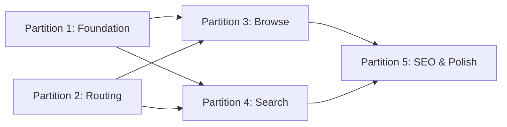

---
summary: "Five feature branches: feat/encyclopedia-foundation (schema+EncyclopediaService+API, backend-only) and feat/frontend-routing (react-router-dom scaffold, intake relocation) run in parallel as the two blocking roots. Once both merge, feat/encyclopedia-browse (PRD Feature 1: section/entry pages) and feat/encyclopedia-search (PRD Feature 2: search/filter) run in parallel, converging in feat/encyclopedia-seo-polish (SEO layer + empty/loading/error states + accessibility pass). No PRs — direct merges throughout."
phase: "approach"
when_to_load:
  - "When starting registered feature branches or reviewing partition scope, sequencing, and dependencies."
  - "When deciding what work can proceed in parallel and what must wait."
depends_on:
  - "prd.md"
  - "ux.md"
  - "tech-design.md"
modules:
  - "backend/app/api, backend/app/services, backend/app/db/migrations"
  - "frontend/src/encyclopedia, frontend/src/router.tsx, frontend/src/intake (relocation only)"
index:
  strategy: "## Strategy"
  partitions: "## Partitions (Feature Branches)"
  sequencing: "## Sequencing"
  migrations_compat: "## Migrations & Compat"
  risks: "## Risks & Mitigations"
  alternatives: "## Alternatives Considered"
next_section: "n/a — finalized"
---

# Approach: Encyclopedia (Encyclopedia + Search, Filtering & Discovery)

## Strategy

**Two parallel foundations, then two parallel features, converging in one polish pass.** `feat/encyclopedia-foundation` (backend: schema, service, API) and `feat/frontend-routing` (frontend: router scaffold, intake relocation) touch disjoint modules and share no code, so they run fully in parallel as the initiative's two blocking roots. Once both merge, the initiative's two named PRD features become their own partitions and also run in parallel, since `feat/encyclopedia-browse` (PRD Feature 1: The Encyclopedia) and `feat/encyclopedia-search` (PRD Feature 2: Search, Filtering & Discovery) touch different frontend components and only share the read-only API contract already fixed by Tech Design. A final `feat/encyclopedia-seo-polish` partition converges both, since SEO metadata and empty/loading/error states depend on the browse and search pages actually existing.

Lifecycle: **no PRs** (per the Builder's PR preference set at Clarify) — every feature branch merges directly into `initiative/encyclopedia`, which merges once to `main`.

No eval step — this initiative does not involve LLMs (`building_on_ai: false`).

---

## Partitions (Feature Branches)

### Partition 1: Encyclopedia Foundation → `feat/encyclopedia-foundation`
**Modules**: `backend/app/api`, `backend/app/services`, `backend/app/db/migrations`
**Scope**: The blocking backend root. Adds `006_encyclopedia.sql` (entries/tags/entry_tags/media schema per Tech Design), `backend/app/services/encyclopedia.py` (`EncyclopediaService` facade with `search_entries()`/`get_entry()`/`get_similar()`, applying the required Factory Method, Flyweight, Strategy, Chain of Responsibility patterns from Tech Design's "Design Patterns (Required)" section), and `backend/app/api/encyclopedia.py` (`GET /api/entries`, `GET /api/entries/{type}/{slug}`, `GET /api/search`). No frontend code.
**Dependencies**: None

#### Artifact Type
rest-api

#### How to Run
- start: `uv run uvicorn backend.app.main:create_app --factory --reload --port 8000`
- ready-check: `GET http://localhost:8000/health returns 200`
- teardown: `Ctrl+C`

#### Acceptance Criteria
- [ ] `GET /api/entries?type=drill` returns 200 with a JSON array of entry summaries, each including `tags`
- [ ] `GET /api/entries?type=invalid` returns 400
- [ ] `GET /api/entries/drill/{slug}` for a published entry returns 200 with full entry fields, `media`, and `similar`
- [ ] `GET /api/entries/drill/{slug}` for a draft-status entry or nonexistent slug returns 404
- [ ] `GET /api/search?q=zone` returns 200 with `{results, total, page, page_size}` and excludes any draft-status entries
- [ ] `GET /api/search?focus=throwing&focus=cutting` returns entries matching either tag (OR within category)
- [ ] `GET /api/search?skill_level=beginner&focus=throwing` returns only entries matching both (AND across categories)
- [ ] `GET /api/search?sort=difficulty_asc` returns results ordered by ascending difficulty
- [ ] Existing `/api/submissions`, `/api/events`, `/api/interview/*` endpoints and their tests remain unaffected (regression check)

#### Implementation Steps
1. Write and run migration `006_encyclopedia.sql` (entry_type/entry_status enums, `entries`, `tags`, `entry_tags`, `media` tables, GIN/btree indexes) via the existing `migrate.py` runner.
2. Implement `EncyclopediaService` with `entry_from_row()` (Factory Method), tag interning (Flyweight), the filter pipeline (Chain of Responsibility), `SortStrategy` implementations, and `TagOverlapStrategy` for `get_similar()`.
3. Implement `backend/app/api/encyclopedia.py` — thin handlers delegating to `EncyclopediaService`, per existing `submissions.py` conventions.
4. Write backend tests (`backend/tests/services/test_encyclopedia.py`, `backend/tests/api/test_encyclopedia.py`) covering the acceptance criteria above, with particular emphasis on the `status = 'published'` gating path (100% coverage per Tech Design NFRs).
5. Reflect: update this partition's tasks.md entries and confirm no existing test suite regressed.

---

### Partition 2: Frontend Routing Scaffold → `feat/frontend-routing`
**Modules**: `frontend/src/router.tsx` (new), `frontend/src/main.tsx` (modified), `frontend/src/intake` (relocation only, no internal logic changes)
**Scope**: Introduces `react-router-dom`, mounts the encyclopedia shell at `/` (placeholder page until Partition 3/4 land) and the existing intake app at `/contribute/*`. Audits `frontend/src/intake/*` for hardcoded root-relative (`/`) assumptions (localStorage keys, absolute navigation, analytics event paths) flagged as a risk in Tech Design, and fixes any found.
**Dependencies**: None

#### Artifact Type
web-ui

#### How to Run
- start: `npm --prefix frontend run dev`
- ready-check: `GET http://localhost:5173/ returns 200`
- teardown: `Ctrl+C`

#### Acceptance Criteria
- [ ] Navigating to `/` renders a placeholder encyclopedia shell (no 404, no blank page)
- [ ] Navigating to `/contribute` renders the existing intake form's first screen unchanged
- [ ] Completing the intake form's existing flow at `/contribute` still results in a successful submission (regression check against Partition 1's unaffected `/api/submissions`)
- [ ] Refreshing the browser at `/contribute` (not just navigating client-side) does not lose in-progress form state that was previously persisted via localStorage
- [ ] All existing frontend tests in `frontend/src/intake/tests/` continue to pass unmodified

#### Implementation Steps
1. Add `react-router-dom` dependency; create `frontend/src/router.tsx` defining `/` (placeholder) and `/contribute/*` (intake) routes.
2. Update `frontend/src/main.tsx` to render the router instead of mounting `App` directly.
3. Audit `frontend/src/intake/state/draft.ts` and any component using absolute (`/`-prefixed) links or path-dependent logic; adjust to be route-relative or explicitly `/contribute`-aware.
4. Confirm existing intake Vitest/RTL suite passes unmodified; add a regression test asserting `/contribute` renders the intake flow.
5. Reflect: update tasks.md; flag any deeper intake coupling to root path discovered during the audit.

---

### Partition 3: Encyclopedia Browse & Entry Pages → `feat/encyclopedia-browse`
**Modules**: `frontend/src/encyclopedia/pages/Home.tsx`, `Section.tsx`, `EntryDetail.tsx`, `frontend/src/encyclopedia/components/EntryCard.tsx`, `Breadcrumbs.tsx`, `SimilarEntries.tsx`, `TagPill.tsx`, `EntrySections/*`, `frontend/src/encyclopedia/api/client.ts`, `types.ts`
**Scope**: PRD Feature 1 — The Encyclopedia. Implements the homepage, five section browse pages (one `Section.tsx` parameterized by type — Template Method pattern), and the shared entry detail template with self-omitting Coaching Points/Common Mistakes/Variations blocks (Decorator pattern) and shared-tag-overlap Similar Entries. Replaces Partition 2's placeholder root page.
**Dependencies**: Requires Partition 1 (API) and Partition 2 (routing) merged first.

#### Artifact Type
full-stack

#### How to Run
- start: `uv run uvicorn backend.app.main:create_app --factory --reload --port 8000` and `npm --prefix frontend run dev`
- ready-check: `GET http://localhost:8000/health returns 200` and `GET http://localhost:5173/ returns 200`
- teardown: `Ctrl+C` (both processes)

#### Acceptance Criteria
- [ ] Visiting `/` shows a hero and a "Popular Resources" card grid with title, short description, difficulty badge, and 2–3 tags per card
- [ ] Visiting `/drills` (and each of `/strategies`, `/formations`, `/plays`, `/skills`) renders a card grid of only published entries of that type
- [ ] Clicking a card on any section page navigates to `/{type}/[slug]` and renders the entry detail template
- [ ] Entry detail page shows title, skill-level/difficulty badges, duration, team size, and primary media above the fold
- [ ] An entry with no recorded Variations does not render a Variations section at all (no empty accordion)
- [ ] Clicking a tag pill on an entry page navigates to a pre-filtered view showing only entries with that tag
- [ ] Entry detail page's Similar Entries row shows up to 3 cards, present only when at least one entry shares a tag
- [ ] Breadcrumbs (`Home / {Section} / {Entry Title}`) render correctly on every section and entry page
- [ ] Visiting a nonexistent slug (e.g. `/drills/not-a-real-slug`) renders a 404 page with links back to the Drills section and search
- [ ] Every entry is reachable in ≤2 clicks from `/` (homepage → section → entry, or homepage → featured card → entry)

#### Implementation Steps
1. Implement `frontend/src/encyclopedia/api/client.ts` and `types.ts` against the fixed Tech Design API contract.
2. Build `EntryCard.tsx`, `Breadcrumbs.tsx`, `TagPill.tsx` as shared primitives.
3. Build `Section.tsx` (one component, `type` route param) and wire it into `router.tsx` for all five section paths.
4. Build `EntryDetail.tsx` (Template Method) with `EntrySections/CoachingPoints.tsx`/`CommonMistakes.tsx`/`Variations.tsx` (Decorator — render `null` when absent) and `SimilarEntries.tsx` (consumes `EncyclopediaService.get_similar()`).
5. Build `Home.tsx` and replace Partition 2's placeholder root route.
6. Write component tests mirroring `frontend/src/intake/tests/` conventions; mock `api/client.ts` fetches.
7. Reflect: update tasks.md; confirm the ≤2-clicks success criterion holds by tracing an example path per entry type.

---

### Partition 4: Search, Filtering & Discovery → `feat/encyclopedia-search`
**Modules**: `frontend/src/encyclopedia/pages/Search.tsx`, `frontend/src/encyclopedia/components/FilterPanel.tsx`, `FilterChips.tsx`
**Scope**: PRD Feature 2 — Search, Filtering & Discovery. Implements the persistent header search bar (added to the shared encyclopedia shell), the `/search` results page, the filter sidebar/drawer with AND-across-categories/OR-within-category semantics, removable filter chips, sort controls, and the non-dead-end empty state.
**Dependencies**: Requires Partition 1 (API) and Partition 2 (routing) merged first. Runs in parallel with Partition 3 — touches different components and shares only the already-fixed API contract.

#### Artifact Type
full-stack

#### How to Run
- start: `uv run uvicorn backend.app.main:create_app --factory --reload --port 8000` and `npm --prefix frontend run dev`
- ready-check: `GET http://localhost:8000/health returns 200` and `GET http://localhost:5173/ returns 200`
- teardown: `Ctrl+C` (both processes)

#### Acceptance Criteria
- [ ] Typing a query into the persistent header search bar (visible on any encyclopedia page) and submitting navigates to `/search?q=...` with matching results
- [ ] On desktop (viewport ≥1024px), the filter panel renders as a left sidebar; on mobile (<640px), it renders collapsed by default behind a "Filters" control
- [ ] Selecting Skill Level = Beginner AND Focus = Throwing narrows results to entries matching both (AND across categories)
- [ ] Selecting Focus = Throwing OR Focus = Cutting (both checked) returns entries matching either (OR within category)
- [ ] Each active filter renders as a removable chip above the results grid; clicking a chip's remove control updates results without a full page reload
- [ ] A filter combination matching zero entries shows a headline naming the most restrictive active filter, a one-tap removal action, and 2–3 close-match cards — never a bare "no results" message
- [ ] Changing sort between Relevance/Difficulty/Newest reorders results accordingly
- [ ] All filter/search interactions are fully operable via keyboard alone

#### Implementation Steps
1. Add the persistent search bar to the shared encyclopedia header/shell (coordinate with Partition 3's `Home.tsx`/`Section.tsx` layout if the shell component is shared — flag in Reflect if a merge conflict surfaces).
2. Build `FilterPanel.tsx` (desktop sidebar / mobile drawer variants) and `FilterChips.tsx`.
3. Build `Search.tsx`, wiring query + filter + sort state to `EncyclopediaService`'s `/api/search` via `api/client.ts` (shared with Partition 3; built in Partition 1's contract).
4. Implement the over-filtered empty state (restrictive-filter callout + close matches).
5. Write component tests for AND/OR filter logic, chip removal, and empty-state rendering.
6. Reflect: update tasks.md; explicitly re-check for any component-boundary overlap with Partition 3 (shared header/shell) before merging.

---

### Partition 5: SEO & Polish → `feat/encyclopedia-seo-polish`
**Modules**: `frontend/src/encyclopedia/seo/Seo.tsx`, `frontend/scripts/generate-sitemap.mjs`, cross-cutting UI states across Partitions 3 and 4
**Scope**: Implements `Seo.tsx` (react-helmet-async per-page title/meta/JSON-LD), the build-time sitemap generation script, and the remaining UX polish pass: loading skeletons, inline error+retry states, accessibility pass (keyboard nav, `aria-expanded` on collapsible sections, AA contrast verification on the badge palette, `prefers-reduced-motion` handling).
**Dependencies**: Requires Partition 3 and Partition 4 merged first (operates on their pages/components).

#### Artifact Type
full-stack

#### How to Run
- start: `uv run uvicorn backend.app.main:create_app --factory --reload --port 8000` and `npm --prefix frontend run dev`
- ready-check: `GET http://localhost:8000/health returns 200` and `GET http://localhost:5173/ returns 200`
- teardown: `Ctrl+C` (both processes)

#### Acceptance Criteria
- [ ] Each entry detail page sets a unique `<title>` and `<meta name="description">` derived from that entry's data (verifiable via page source/DOM inspection)
- [ ] Drill entry pages emit a `<script type="application/ld+json">` block with schema.org `HowTo` type
- [ ] Running `node frontend/scripts/generate-sitemap.mjs` produces a `sitemap.xml` listing every published entry and section URL
- [ ] Section/search results grids show skeleton placeholders (matching final card dimensions) while data is loading, not a blank area
- [ ] A simulated failed `/api/search` request shows an inline error message with a retry action, not a blank page
- [ ] All collapsible entry-page sections (Coaching Points, Common Mistakes, Variations) expose `aria-expanded` and are operable via keyboard (Enter/Space to toggle)
- [ ] Difficulty/skill-level badges display a text label or icon alongside color (never color alone) <!-- NEEDS MANUAL REVIEW: exact badge component visual review is subjective; automate only the DOM-text-present check -->
- [ ] All accent/badge/text-on-background color combinations meet WCAG AA contrast (automated contrast-checker pass, e.g. via axe or a Lighthouse accessibility audit ≥ 90)

#### Implementation Steps
1. Build `Seo.tsx` and wire it into `EntryDetail.tsx`/`Section.tsx`/`Home.tsx` from Partition 3, and `Search.tsx` from Partition 4.
2. Build `frontend/scripts/generate-sitemap.mjs`, calling `/api/entries` for each type and emitting `sitemap.xml` into `frontend/dist`.
3. Add loading skeletons and inline error+retry states to the results grids and entry detail page.
4. Accessibility pass: `aria-expanded`/keyboard handling on collapsible sections, contrast audit on the badge palette, `prefers-reduced-motion` checks on any transitions.
5. Run an automated accessibility audit (axe-core or Lighthouse) against representative pages and address findings.
6. Reflect: update tasks.md; confirm PRD Success Criteria (≤2 clicks, Content Checklist compliance, draft-gating) all still hold end-to-end.

---

## Sequencing



### Partitions DAG

```yaml partitions
- name: feat/encyclopedia-foundation
  modules: [backend/app/api, backend/app/services, backend/app/db/migrations]
  depends_on: []                    # parallel — will get a worktree

- name: feat/frontend-routing
  modules: [frontend/src/router.tsx, frontend/src/main.tsx, frontend/src/intake]
  depends_on: []                    # also parallel

- name: feat/encyclopedia-browse
  modules: [frontend/src/encyclopedia/pages/Home.tsx, frontend/src/encyclopedia/pages/Section.tsx, frontend/src/encyclopedia/pages/EntryDetail.tsx, frontend/src/encyclopedia/components/EntryCard.tsx, frontend/src/encyclopedia/components/Breadcrumbs.tsx, frontend/src/encyclopedia/components/TagPill.tsx, frontend/src/encyclopedia/components/SimilarEntries.tsx, frontend/src/encyclopedia/components/EntrySections, frontend/src/encyclopedia/api, frontend/src/encyclopedia/types.ts]
  depends_on: [feat/encyclopedia-foundation, feat/frontend-routing]

- name: feat/encyclopedia-search
  modules: [frontend/src/encyclopedia/pages/Search.tsx, frontend/src/encyclopedia/components/FilterPanel.tsx, frontend/src/encyclopedia/components/FilterChips.tsx]
  depends_on: [feat/encyclopedia-foundation, feat/frontend-routing]

- name: feat/encyclopedia-seo-polish
  modules: [frontend/src/encyclopedia/seo, frontend/scripts]
  depends_on: [feat/encyclopedia-browse, feat/encyclopedia-search]
```

---

## Migrations & Compat

- `006_encyclopedia.sql` is purely additive (new tables/enums) — no existing table is altered, so no downtime or backfill is required. Run via the existing `migrate.py` runner alongside migrations `001`–`005`.
- The intake form's relocation from `/` to `/contribute/*` (Partition 2) is a URL-structure change for an app with no external inbound links yet (per project context, the intake form is not yet publicly launched at a stable URL), so no redirect/backward-compatibility shim is required. If the intake form has already been shared externally under a root URL, flag this during Partition 2's Reflect step before merging.
- No data migration is needed for encyclopedia content itself — this initiative ships the schema and UI only; populating actual entries from the 95+ curated sources is explicitly out of scope (a later initiative).

---

## Risks & Mitigations

| Risk | Mitigation |
|------|------------|
| Partitions 3 and 4 both touch the encyclopedia's shared header/shell (search bar lives in the header, per UX) | Partition 2 owns the initial shell/header component as a shared primitive; Partitions 3 and 4 both extend it rather than redefining it — flagged explicitly in Partition 4's Implementation Steps to re-check for conflicts before merging. |
| Partition 2's intake-relocation audit surfaces deeper root-path coupling than expected (Tech Design's flagged risk) | Treat this as a spike within Partition 2 itself, not a separate partition — if it proves substantial, halt and escalate to the Builder before continuing per the Escalation Criteria in the Cicadas lightweight-path guidance (this is a full initiative already, so escalation here means re-scoping Partition 2's tasks, not switching lifecycle paths). |
| Partition 5 (SEO/Polish) is the only fully sequential partition and could become a bottleneck if 3 and 4 run long | Both 3 and 4 are independently mergeable and testable before 5 starts; no work in 5 is blocked on anything except 3 and 4 existing, so there's no reason for 5 to start early or degrade quality by rushing 3/4. |
| Draft-entry leakage regression as new code paths are added across partitions | Tech Design mandates `status='published'` gating inside `EncyclopediaService` itself (Partition 1) with 100% test coverage on that path — Partitions 3–5 consume the service and cannot bypass the gate, so the risk is contained to Partition 1's own correctness. |

---

## Alternatives Considered

- **Single monolithic feature branch instead of 5 partitions** — rejected: Foundation (backend) and Routing (frontend infra) are fully independent and benefit from parallel worktrees; splitting Browse from Search directly mirrors the PRD's own two named features, keeping partition scope legible and directly traceable to FR-2.x vs FR-3.x/FR-4.x.
- **Merging Routing into Foundation as one partition** — rejected: they touch entirely disjoint modules (backend vs. frontend infra) with zero shared files, so forcing them into one branch would only remove parallelism for no coordination benefit.
- **Folding SEO into Partition 3 (Browse) directly** — rejected: SEO/meta concerns apply equally to Partition 4's search results page, and polish (loading/error states, accessibility) cuts across both — a dedicated convergence partition avoids duplicating that work or picking an arbitrary owner between 3 and 4.
