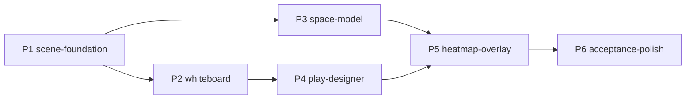

# Approach: Field View

## Strategy

**Mostly sequential, with one deliberate parallel pair.**

The brief fixes the build order — *whiteboard → keyframes → heatmap overlay* — and states this
was an explicit architectural decision: it makes the ambitious feature a layer on a working
product rather than a standalone gamble. That order is honoured for everything user-facing.

The one departure: the **headless space model** (pure math, no UI, no viewport) is built in
parallel with the whiteboard rather than waiting for the play designer. It shares no files with
the whiteboard partition — it depends only on the frozen scene model — and it is the highest-risk
work in the initiative, so it deserves the longest runway. The heatmap *UI* still lands after the
keyframe work, exactly as mandated. **This reading is flagged for client confirmation** (PRD open
question 5); if rejected, `feat/space-model` simply moves after `feat/play-designer` with no
other change to the plan.

Everything is client-side. There is no backend partition, no migration, and no shared-schema
coordination with other initiatives — the only files outside `frontend/src/fieldview/` that any
partition touches are `router.tsx` and one nav link, both claimed by partition 1 to keep the
merge surface at one file per shared touchpoint.

**Client gates, after the spec review.** The client resolved four of the five open questions and
moved the visual review to the end: they review all visuals, presets, and UI once the tool is
complete rather than gating the whiteboard branch on a mock-up. So exactly **two** hard stops
remain — the play JSON schema review in Partition 4 (it is a site-wide contract) and the manual
acceptance-check pass in Partition 6. The mock-up is still produced first in Partition 2 for
early signal, but it does not block. The compensating requirement is that all piece visuals live
in one tokens module (ADR-10), so the late review is cheap to act on.

**Scope change from that review.** Presets became a *system*, not four setups (PRD FR-2.6): the
client intends to author conventionally correct setups personally, later, and wants to promote a
whiteboard formation to a site-wide preset. Partition 2 therefore builds a preset registry with
save/rename/delete/export/import over `localStorage`, with built-ins as data on the same path
(ADR-9). Calibrating the four built-in coordinates is explicitly *not* where effort goes.

---

## Partitions (Feature Branches)

### Partition 1: Scene Foundation → `feat/scene-foundation`
**Modules**: `frontend/src/fieldview/scene`, `frontend/src/fieldview/render`,
`frontend/src/fieldview/pages`, `frontend/src/router.tsx`
**Scope**: The blocking contract every other partition builds on — scene types, field
constants and geometry, pure scene operations, the mutable subscribe-store + rAF scheduler, the
four presets as data, the SVG field layer (sidelines, goal lines, brick marks, attack
direction), and the two routes rendering a static scene. No dragging, no overlay, no timeline.
**Dependencies**: None.

#### Artifact Type
web-ui

#### How to Run
- start: `cd frontend && npm run dev`
- ready-check: `http://localhost:5173/field-view` renders a regulation field with 14 pieces from the vert-stack preset
- teardown: `Ctrl+C`

#### Acceptance Criteria
- [ ] `GET /field-view` and `/field-view/designer` both render the field; existing routes (`/`, `/search`, `/:section`, `/contribute`) are unaffected — verified by the existing router tests still passing
- [ ] Field renders at regulation proportions: 110 × 40 yd, two 20-yd endzones, goal lines, brick marks at 20 yd from each goal line, unambiguous attacking-direction indicator
- [ ] All four presets load a complete 14-piece scene (1 thrower + 6 cutters + 1 mark + 6 defenders) with every piece inside field bounds — asserted in `scene.test.ts`
- [ ] `moveThrower()` translates the mark by the same delta, preserving relative offset (FR-2.2)
- [ ] Any scene operation that would place a piece outside the field clamps it to the boundary
- [ ] `scene/` imports nothing from React, the DOM, or canvas — asserted by an import check in tests
- [ ] `store.mutate()` notifies subscribers and schedules exactly one rAF callback per frame regardless of how many mutations occurred in that frame

#### Implementation Steps
1. `scene/types.ts`, `scene/field.ts` — model + field geometry in yards.
2. `scene/scene.ts` — pure ops (`movePlayer`, `moveThrower`, bounds clamp).
3. `scene/store.ts` — subscribe-store + rAF coalescing (ADR-2).
4. `scene/presets.ts` — the four setups from PRD FR-2.5 as coordinate data.
5. `render/fieldLayer.tsx` — SVG field markings, yard→pixel transform.
6. `pages/Whiteboard.tsx`, `pages/Designer.tsx` shells + `router.tsx` routes + nav link.
7. Tests: scene ops, presets, store coalescing, router regression.

---

### Partition 2: Whiteboard → `feat/whiteboard`
**Modules**: `frontend/src/fieldview/render`, `frontend/src/fieldview/ui`,
`frontend/src/fieldview/pages`
**Scope**: Mode 1 in full — the piece layer with its visual language (all tokens in
`render/tokens.ts`, ADR-10), pointer drag with imperative transforms, thrower-carries-mark,
generous hit targets, the **preset system** (registry, built-ins as data, save/rename/delete/
export/import over `localStorage`, overwrite confirm), PNG frame export, and the keyboard nudge
path. The HTML mock-up is produced first and shared for early signal, but does not block the
branch — the binding visual review is in Partition 6.
**Dependencies**: Requires Partition 1.

#### Artifact Type
web-ui

#### How to Run
- start: `cd frontend && npm run dev`
- ready-check: `http://localhost:5173/field-view` — pieces drag under the pointer and follow it continuously
- teardown: `Ctrl+C`

#### Acceptance Criteria
- [ ] Every one of the 14 pieces can be dragged with mouse and with touch; the piece follows the pointer continuously, not on release
- [ ] Dragging the thrower moves the mark by the same delta; the mark can also be dragged alone (FR-2.2)
- [ ] There is no force control anywhere in the UI — the mark's bearing off the thrower is the only force input (FR-2.3)
- [ ] The disc renders docked to the thrower and follows it, with no separate disc state
- [ ] Each of the four built-in presets loads in one click; loading over a modified scene shows the inline `Replace the current setup?` confirm first
- [ ] `Save current as preset` names and stores the current scene; it survives a reload, appears under `Your presets`, and loads identically to a built-in (FR-2.6)
- [ ] User presets can be renamed, deleted (with 5 s `Undo`), exported, and re-imported; built-ins expose no delete/rename and cannot be destroyed
- [ ] Built-ins and user presets load through one registry — there is no privileged code path for built-ins (ADR-9)
- [ ] An imported or `localStorage`-corrupted preset is validated on read, has any `builtin` flag stripped, and a bad entry is dropped with a notice rather than breaking the menu
- [ ] Every piece/field colour, radius, stroke, and glyph is read from `render/tokens.ts`; no visual literal appears in a component (ADR-10)
- [ ] Offense vs. defense are visually distinct; thrower and mark are individually identifiable; the mark shows a directional indicator
- [ ] `Export frame` downloads a PNG of the current field
- [ ] A focused piece moves 1 yd per arrow key, 5 yd with Shift
- [ ] Pointer hit area for each piece is ≥ 44 × 44 px
- [ ] axe-core reports no violations on `/field-view`
- [ ] The HTML mock-up exists at `.cicadas/active/field-view/mockups/whiteboard-overlay.html` and has been shared with the client for early signal (non-blocking; binding review is Partition 6)

#### Implementation Steps
1. Produce the mock-up (UXD §Mock-Ups) and share it for early signal — do not block on a reply.
2. `render/tokens.ts` — every piece/field visual token in one place (ADR-10).
3. `render/pieceLayer.tsx` — SVG pieces + pointer handlers writing to the store.
4. Imperative drag transforms (no React state per pointer move, ADR-2).
5. `scene/presetFormat.ts` + the `PresetRegistry` over built-ins and `localStorage` (ADR-9).
6. `ui/PresetMenu.tsx` — grouped list, save/rename/delete/export/import, overwrite confirm.
7. `render/exportImage.ts` — PNG export; resolve the SVG-compositing approach here, not later.
8. Keyboard nudge + focus order + axe pass.
9. Tests: drag behaviour (RTL pointer events), thrower-carries-mark, clamping, preset
   round-trip + validation, a11y.

---

### Partition 3: Space Model (headless) → `feat/space-model`
**Modules**: `frontend/src/fieldview/space`, `frontend/src/fieldview/tests`
**Scope**: The complete validated model from brief §4 as a pure, framework-free library:
constants, math helpers, the five layer functions, `computeGrid`, `explainCell`, the colour
ramp, and every brief §8 acceptance check that is a property of the model rather than of the UI
(checks 1, 2, 3, 4, 6, 7, 8) as executable tests. Checks 5 and 9 are drag-and-repaint properties
and belong to Partition 5. **No UI whatsoever.**
**Dependencies**: Requires Partition 1 (scene types only). Runs in parallel with Partition 2.

#### Artifact Type
library

#### How to Run
- start: _(no persistent process)_
- ready-check: `cd frontend && npm test -- space` — all space-model and acceptance tests pass
- teardown: n/a

#### Acceptance Criteria
- [ ] `space/` imports nothing from React, the DOM, or canvas — asserted by an import check
- [ ] Every factor of brief §4.3 (`comp`, `mark`, `coverage`, `lane`, `value`) is a separately exported function with the brief's formula transcribed as its comment, and has a direct unit test
- [ ] No numeric constant from brief §4.4 appears outside `space/constants.ts` — asserted by a source scan test
- [ ] **FR-3.2 regression test:** with all six cutters removed, far open-side space still scores as open (no receiver-reachability gate anywhere)
- [ ] §8.1 — on the vert/force-side preset, the open-side lane 5–15 yd upfield of the thrower is the highest-scoring region on the field
- [ ] §8.2 — the break side behind the mark's shadow scores lowest near the force bearing and rises with angular distance; short break-side reset space scores above the shadow floor (distance ramp)
- [ ] §8.3 — wide-open dump/reset space scores above the "closed" threshold (yellow, never red)
- [ ] §8.4 — with no deep defender the deep third scores mid-range; the *deep help* preset lowers it; adding a cutter deep raises it again
- [ ] §8.6 — a cutter adjacent to its matched defender produces mid-range (contested) scores around the pair, not high scores, with no special-casing in the code
- [ ] §8.7 — a defender parked in a throwing lane lowers scores behind it even at cells it cannot beat the disc to
- [ ] §8.8 — each of the 6 sliders and each of the 4 layer toggles produces a non-zero score delta on the default presets
- [ ] Layer toggles are implemented by substituting `1.0` at the call site, not by branching inside layer functions (ADR-5)
- [ ] `Lens = "defense-only"` skips only the `beat` term inside `coverage`; there is no second pipeline (ADR-6)
- [ ] `computeGrid` is allocation-free across repeated calls (reuses its output buffer) and completes a 220 × 80 × 14 grid within the documented budget

#### Implementation Steps
1. `space/constants.ts` — brief §4.4 verbatim, single source of truth.
2. `space/math.ts` — `ss`, `wrap`, `bearing`, `clamp`, point-segment projection.
3. `space/layers.ts` — the five factors, one function each, formulas as comments.
4. `space/score.ts` — `scoreCell` + `computeGrid` with buffer reuse and per-defender precompute.
5. `space/explain.ts` — `CellExplain` payload for the readout.
6. `space/palette.ts` — gamma + ramp stops → RGBA.
7. `tests/space-model.test.ts` + `tests/acceptance.test.ts` (checks 1, 2, 3, 4, 6, 7, 8, plus the FR-3.2 regression).

---

### Partition 4: Play Designer → `feat/play-designer`
**Modules**: `frontend/src/fieldview/play`, `frontend/src/fieldview/ui`,
`frontend/src/fieldview/pages`
**Scope**: Mode 2 — the versioned play format, serialization, import validation, linear tween,
the keyframe timeline (chips, playhead, reorder, retime, select, delete-with-undo), transport
controls, play metadata, and JSON import/export behind the `PlayStore` seam.
**Dependencies**: Requires Partition 2.

#### Artifact Type
web-ui

#### How to Run
- start: `cd frontend && npm run dev`
- ready-check: `http://localhost:5173/field-view/designer` — timeline strip present, `+ Keyframe` adds a chip, Play animates between two keyframes
- teardown: `Ctrl+C`

#### Acceptance Criteria
- [ ] Entering Designer mode carries the current whiteboard scene in as keyframe 1 at `0.0s`
- [ ] Keyframes can be added, deleted, reordered, and retimed; the strip lays chips out proportionally to timestamp
- [ ] Play/pause/scrub work; playback tweens player and disc positions linearly between keyframes at real time
- [ ] Tweening pairs entities by stable `id`, not array index — reordering the players array does not teleport pieces
- [ ] With one keyframe, Play is disabled and shows `Add a second keyframe to play.`
- [ ] Editing the field while scrubbed between keyframes is blocked with the inline offer `Select a keyframe to edit, or add one here.`, and the offer inserts a keyframe capturing the interpolated scene
- [ ] Deleting a keyframe shows a 5 s `Undo` toast that restores it
- [ ] `Export play` downloads a `PlayFile` with `formatVersion`, `entities`, sorted `keyframes`, and explicit `field`
- [ ] Round-trip export → import reproduces an identical scene sequence
- [ ] A malformed, wrong-type, or newer-`formatVersion` file is rejected with a specific message and **leaves the current scene untouched**
- [ ] Play `name`/`description` render as text nodes only and are length-capped on import
- [ ] axe-core reports no violations on `/field-view/designer`; the timeline is fully keyboard operable

#### Implementation Steps
1. `play/format.ts` — `PlayFile` v1 types + `PLAY_FORMAT_VERSION`.
2. `play/serialize.ts` + the `PlayStore` seam with `FilePlayStore`.
3. `play/validate.ts` — boundary validation for untrusted imports.
4. `play/tween.ts` — `sampleAt(play, t)`.
5. `ui/Timeline.tsx` — chips, playhead, reorder, retime, select, delete + undo.
6. `ui/PlayMeta.tsx` — name/description, import/export.
7. Tests: round-trip, malformed-import rejection, tween correctness, timeline RTL, a11y.

---

### Partition 5: Heatmap Overlay → `feat/heatmap-overlay`
**Modules**: `frontend/src/fieldview/render`, `frontend/src/fieldview/ui`,
`frontend/src/fieldview/pages`
**Scope**: Mode 3's UI — the canvas painter, the overlay rail (Space toggle, lens switch, four
layer toggles, legend), the tuning panel, the hover readout, `localStorage` preferences, and the
frame-budget validation. The model itself already exists and is validated by Partition 3; this
partition integrates it and must not modify `space/`.
**Dependencies**: Requires Partition 3 (the model) and Partition 4 (per the brief's mandated
build order: whiteboard → keyframes → heatmap).

#### Artifact Type
web-ui

#### How to Run
- start: `cd frontend && npm run dev`
- ready-check: `http://localhost:5173/field-view` — toggling `SPACE` paints the heatmap; dragging the mark repaints it continuously
- teardown: `Ctrl+C`

#### Acceptance Criteria
- [ ] The `SPACE` toggle paints the heatmap under the pieces in both `/field-view` and `/field-view/designer`
- [ ] **§8.5 / FR-2.1** — dragging the mark from a side force to flat rotates which side of the field is closed, and swinging the thrower across the field flips strong space to the other side, **live during the drag** (repaint on pointermove, not on release)
- [ ] **§8.9** — grid recompute + paint stays within the frame budget while dragging on ordinary hardware; measured and logged via the `?perf=1` dev readout
- [ ] Zero React re-renders occur per pointer move during a drag (ADR-2) — asserted by a render-count test
- [ ] The lens switch offers `Offense` / `Defense only` with their helper sentences, and defense-only removes the cutter row from the readout
- [ ] All four layer toggles visibly change the map; the tuning panel is collapsed by default, shows live numeric values, repaints during slider drag, and has `Reset to defaults`
- [ ] The tuning header shows a modified marker whenever any slider is off its default
- [ ] The hover readout shows distance, flight time, nearest defender arrival, best cutter effective arrival (offense lens only), score, and one of `Strong` / `Contested` / `Closed`
- [ ] The three-swatch legend (`Closed` / `Open, low value` / `Strong space`) is visible whenever the overlay is on
- [ ] Colour meaning is never carried by hue alone — the legend and the verbal readout label carry it redundantly
- [ ] Rail toggle and tuning preferences persist across reloads; the scene does not
- [ ] `prefers-reduced-motion` suppresses the overlay fade and chip transitions but **not** the live repaint or playback tweening
- [ ] This partition changes no file under `space/`

#### Implementation Steps
1. `render/heatmap.ts` — offscreen `ImageData` at grid resolution, upscaled `drawImage`; build and measure against a synthetic grid **before** wiring the real model.
2. `ui/FieldCanvas.tsx` — stack canvas + SVG, own the rAF loop, wire `onFrame`.
3. `ui/OverlayRail.tsx` — Space toggle, lens, layer toggles, legend.
4. `ui/TuningPanel.tsx` — six sliders, live values, reset, modified marker.
5. `ui/CellReadout.tsx` — hover sampling + live region.
6. `prefs.ts` — `localStorage` persistence for rail state.
7. `?perf=1` frame-timing readout; measure and record the budget.
8. Tests: render-count assertion, RTL for rail/tuning/readout, axe, perf.

---

### Partition 6: Acceptance & Polish → `feat/acceptance-polish`
**Modules**: `frontend/src/fieldview/ui`, `frontend/src/fieldview/pages`,
`frontend/src/fieldview/tests`
**Scope**: The client-facing verification pass and the cross-cutting polish that only makes
sense once all three modes exist: the scripted manual acceptance-check run, **the client's
end-of-initiative review of all visuals, presets, and UI** (the review they deferred to this
point), tablet layout, the sub-768 px message, the full a11y sweep, and the adjustments that
review produces.
**Dependencies**: Requires Partition 5.

#### Artifact Type
web-ui

#### How to Run
- start: `cd frontend && npm run dev`
- ready-check: `cd frontend && npm test` — full suite green; then walk the scripted checklist
- teardown: `Ctrl+C`

#### Acceptance Criteria
- [ ] A written acceptance checklist covering all nine §8 checks exists at `.cicadas/active/field-view/acceptance-checklist.md`, with each check marked automated or manual
- [ ] All nine §8 checks pass on default constants and the client has signed off on the manual ones <!-- NEEDS MANUAL REVIEW -->
- [ ] Tablet (768–1279 px): field full-width, rail as a horizontal control bar, touch drag works
- [ ] Below 768 px: a readable message pointing to desktop/tablet, not a broken canvas
- [ ] axe-core clean on both routes at both breakpoints; full keyboard traversal of every control
- [ ] Full frontend test suite passes with no regressions to the existing 107 frontend tests
- [ ] The client's end-of-initiative review of all visuals, presets, and UI is run and its adjustments applied — expected to be `render/tokens.ts` edits and preset coordinate tweaks <!-- NEEDS MANUAL REVIEW -->

#### Implementation Steps
1. Write `acceptance-checklist.md` mapping each §8 check to its automated test or manual script.
2. Run the manual checks with the client; record outcomes and any calibration requests.
3. Apply preset/visual adjustments.
4. Tablet + sub-768 layouts.
5. a11y sweep, keyboard traversal, reduced-motion verification.
6. Full-suite regression run.

---

## Sequencing

Partitions 2 and 3 are the only parallel pair; everything else is a chain. Partition 3 is
started at the same time as Partition 2 because it is the highest-risk work and shares no files
with the UI track.



### Partitions DAG

```yaml partitions
- name: feat/scene-foundation
  modules: [frontend/src/fieldview/scene, frontend/src/fieldview/render, frontend/src/fieldview/pages]
  depends_on: []

- name: feat/whiteboard
  modules: [frontend/src/fieldview/render, frontend/src/fieldview/ui, frontend/src/fieldview/pages]
  depends_on: [feat/scene-foundation]

- name: feat/space-model
  modules: [frontend/src/fieldview/space, frontend/src/fieldview/tests]
  depends_on: [feat/scene-foundation]

- name: feat/play-designer
  modules: [frontend/src/fieldview/play, frontend/src/fieldview/ui, frontend/src/fieldview/pages]
  depends_on: [feat/whiteboard]

- name: feat/heatmap-overlay
  modules: [frontend/src/fieldview/render, frontend/src/fieldview/ui, frontend/src/fieldview/pages]
  depends_on: [feat/space-model, feat/play-designer]

- name: feat/acceptance-polish
  modules: [frontend/src/fieldview/ui, frontend/src/fieldview/pages, frontend/src/fieldview/tests]
  depends_on: [feat/heatmap-overlay]
```

> Note: `feat/whiteboard` and `feat/space-model` both declare `depends_on:
> [feat/scene-foundation]`, so under the DAG's parallel/sequential rule they are plain branches
> off the initiative rather than worktrees. They can still be worked concurrently — they overlap
> in no file — but if concurrent worktrees are wanted, that is a `branch.py --worktree` call at
> start time, not a change to this DAG.

---

## Migrations & Compat

Nothing to migrate. No database, no backend, no existing user data, no API contract touched.

The only compatibility surface is **`PLAY_FORMAT_VERSION`**, which ships at `1` and is the
contract the encyclopedia's drill visualizer and the AI-animation pipeline will later write
against. The import guard rejects newer versions with a legible message and leaves room for an
explicit upgrade function when a v2 arrives — so early exported plays remain readable.

Shared-file merge surface across partitions is deliberately minimal: `router.tsx` and the nav
link are claimed by Partition 1 only; `ui/` is touched by partitions 2, 4, and 5 but in disjoint
files (`PresetMenu` / `Timeline`+`PlayMeta` / `OverlayRail`+`TuningPanel`+`CellReadout`+
`FieldCanvas`).

---

## Risks & Mitigations

| Risk | Mitigation |
|------|------------|
| The validated model gets re-derived or "improved" during implementation | Brief §4 is transcribed verbatim into tech-design; formulas are code comments; §8 checks are executable tests in P3; ADR-5 forbids inlining constants or branching inside layers |
| The v2 receiver-gate regression returns (openness accidentally requires a cutter) | A dedicated P3 acceptance criterion: remove all cutters, assert far open-side space still reads open |
| 60 fps missed at 0.5 yd grid | P5 builds and measures the painter against a synthetic grid before wiring the model; `GRID_STEP` is a single constant (ADR-4); a render-count test guards the "React not in the drag path" invariant |
| Client reviews visuals only at the end, so restyling lands late | All piece/field visuals centralised in `render/tokens.ts` (ADR-10), so the review produces token edits, not a component sweep; P2 still shares a mock-up early for signal; P6 reserves time for applying the feedback |
| Preset system built narrowly around the four built-ins | Built-ins and user presets share one registry and one file format (ADR-9); P2 acceptance criteria require save/rename/delete/export/import to work before the partition closes |
| Manual acceptance checks are subjective and can slip past unverified | P6 exists solely to make the checklist a written artifact with per-check automated/manual status and recorded client sign-off |
| P5 becomes a bottleneck holding both the model and all the overlay UI | P3 delivers the model fully tested and standalone, so P5 is integration work only and is forbidden from editing `space/` |
| PNG export compositing SVG over canvas hits browser quirks late | Resolved in P2 (with a draw-pieces-to-canvas fallback), not deferred to polish |
| Between-keyframe editing produces surprising behaviour | Specified as blocked-with-an-offer rather than silently permitted; covered by an explicit P4 acceptance criterion |
| Nav placement / slug changes after routes are cemented | Routes are one file (P1) and the slug is an open question raised before kickoff; a rename is a single-file change |

---

## Alternatives Considered

**Strict serial order (space model only after the play designer).** This is the literal reading
of the brief's build order. Rejected — but only for the *headless* model, and flagged for client
confirmation. The mandated order exists so the heatmap is a layer on a working product rather
than a standalone gamble; building the math library early does not violate that, because nothing
ships to a user until P5, and it buys the riskiest work the longest runway. If the client prefers
the literal reading, move P3 after P4 and change nothing else.

**Three separate tools / three separate scene models.** Explicitly rejected by the brief ("do not
build three separate tools"), and it would fork the space model away from the play format.

**Model split across partitions (coverage in one, lanes/value in another).** Rejected — the
acceptance checks are properties of the *whole* pipeline, so a partition that owns half of it
cannot demonstrate correctness.

**WebGL / shader heatmap.** Rejected for v1: brief §9 proved plain canvas meets the budget, and a
GPU path adds context-loss handling and a second render path for the PNG export. Kept as a
contingency behind `GRID_STEP`.

**A state library (zustand/Redux).** Rejected — per-frame updates must bypass React regardless,
so a library adds surface without addressing the actual constraint, and the repo currently uses
plain modules.

**Its own Next.js app or a separate deployment.** Rejected — the encyclopedia already made the
"extend the single SPA in place" call; a second app would fork the design system and the router
for a client-only feature that needs neither SSR nor a backend.
