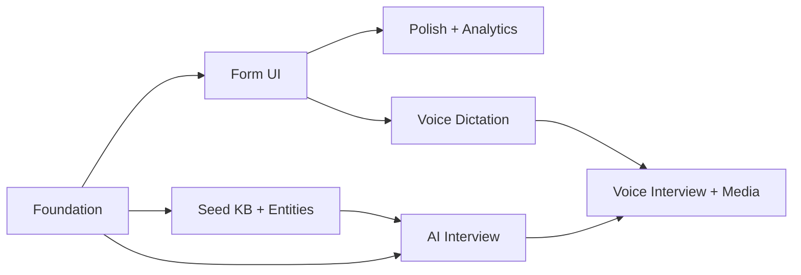

# Worktree Context
> Auto-generated by branch.py. Do not commit — see .gitignore.

## approach.md


---
summary: "Phased build of v1 form then v2 AI interview as one initiative, partitioned into 7 feature branches. Foundation (schema+Supabase+API) is the blocking root; it unblocks two parallel tracks — the form track (form-ui → polish → voice-dictation) and the AI track (seed-kb+entities → ai-interview) — which converge at voice-interview+media+enrichments. No PRs configured; direct merges to the initiative branch. Strict phasing keeps the v1 form usable before any AI work starts."
phase: "approach"
when_to_load:
  - "When starting registered feature branches or reviewing partition scope, sequencing, and dependencies."
  - "When deciding what work can proceed in parallel and what must wait."
depends_on:
  - "prd.md"
  - "ux.md"
  - "tech-design.md"
modules:
  - "backend, frontend, data/seed-kb"
index:
  strategy: "## Strategy"
  partitions: "## Partitions (Feature Branches)"
  sequencing: "## Sequencing"
  migrations_compat: "## Migrations & Compat"
  risks: "## Risks & Mitigations"
  alternatives: "## Alternatives Considered"
next_section: "Strategy"
---

# Approach: Ulti-pedia Knowledge Intake

## Strategy

**Phased, with two parallel tracks after a shared foundation.** The whole thing rests on one
versioned submission envelope + the backend that writes it, so **Foundation ships first and
blocks everything.** Once it exists, two independent tracks run in parallel:

- **Form track** — the usable v1 product: form UI → polish/analytics → voice dictation.
- **AI track** — the v2 brains: seed KB + entity/coverage registry → AI interview engine.

They converge in a final partition (voice interview, media, enrichments). This ordering means
**the v1 form is fully usable and collecting data before any AI work is required** — the
PRD's strict-phasing risk mitigation. Lifecycle: **no PRs** — feature branches merge directly
into `initiative/ulti-pedia-form`, which merges once to `main`.

Evals run **in parallel** with the AI track (the AI interview engine is the thing being
evaluated). See eval-spec.md; the eval harness is authored alongside `feat/ai-interview`,
not gated before it. ⚠️ Parallel evals mean the interview engine could merge before eval
gates are green — keep `confirm-always` entity matching and the freeform escape hatch on
until eval thresholds are met in production.

---

## Partitions (Feature Branches)

### Partition 1: Foundation — schema, Supabase, submission API → `feat/foundation`
**Modules**: `backend/app/schemas`, `backend/app/services` (validation, storage),
`backend/app/api` (submissions, events), `backend/app/db/migrations`
**Scope**: The envelope schema (the contract), Supabase `submissions` + `form_events` tables,
FastAPI skeleton, server-side validation/anti-troll, `POST /api/submissions`, `POST /api/events`.
**Dependencies**: None (blocking root).

#### Artifact Type
rest-api

#### How to Run
- start: `uvicorn backend.app.main:app --reload --port 8000`
- ready-check: `GET http://localhost:8000/health returns 200`
- teardown: `Ctrl+C`

#### Acceptance Criteria
- [ ] `POST /api/submissions` with a valid drill envelope returns `201 {submission_id}` and a row appears in Supabase with envelope + `fields` + `raw_freeform`.
- [ ] Oversized payload returns `413`; whitespace-only required content rejected; tripped honeypot returns `400`; exceeding the rate limit returns `429`.
- [ ] `POST /api/events` with `form_started` returns `204` and persists a `form_events` row.
- [ ] Supabase service key is read from env server-side only (not present in any client artifact). <!-- NEEDS MANUAL REVIEW -->
- [ ] `schema_version` is stamped on every stored row.

#### Implementation Steps
1. Define `schemas/envelope.py` (+ drill/strategy type models) per tech-design Data Models.
2. Write migrations `001_submissions.sql`, `002_events.sql`; apply to Supabase.
3. FastAPI skeleton + `config.py` (env settings) + `/health`.
4. `services/validation.py` (caps, honeypot, rate limit, garbage→`flagged`) and
   `services/storage.py` (sole Supabase writer).
5. `api/submissions.py` + `api/events.py`; tests for validation + storage.

### Partition 2: Form UI → `feat/form-ui`
**Modules**: `frontend/src/sections`, `frontend/src/state`, `frontend/src/api`, `frontend/src/ui`
**Scope**: Mobile-first React shell; tutorial→path-select→type sections; optional fields +
freeform; tap tooltips; autosave + save + retry queue; contributor+consent+prefill;
confirm→thank-you→submit-another. Wires to `feat/foundation` API.
**Dependencies**: Requires `feat/foundation` (the submission API + envelope).

#### Artifact Type
web-ui

#### How to Run
- start: `cd frontend && npm run dev`
- ready-check: `GET http://localhost:5173 returns 200`
- teardown: `Ctrl+C`

#### Acceptance Criteria
- [ ] On mobile viewport, a user can go tutorial → Drills → fill freeform → submit and see the thank-you screen, one-handed.
- [ ] Typing then refreshing the page restores the in-progress draft from localStorage.
- [ ] Switching path with unsaved input shows the data-loss warning; cancel keeps the work.
- [ ] A submit while offline keeps the draft and retries; no data lost. <!-- NEEDS MANUAL REVIEW -->
- [ ] Contributor info entered once is prefilled on the next submission in the session.
- [ ] Tooltips open on tap (not hover).

#### Implementation Steps
1. Vite/React/TS + Tailwind scaffold; mobile-first layout primitives + tap `Tooltip`.
2. Sections: Tutorial, PathSelect, Drill, Strategy (formation/play/concept), Other,
   Contributor, Confirm, ThankYou.
3. `state/draft.ts`: debounced localStorage autosave, restore, Save button, retry queue.
4. `api/client.ts`: POST submission + events; optimistic UI + failure handling.
5. Switch-away warning; confirm-before-submit; submit-another loop; component tests.

### Partition 3: Polish & analytics → `feat/polish-analytics`
**Modules**: `frontend/src/ui`, `frontend/src/sections` (animation), analytics wiring
**Scope**: Framer Motion slide/expand/shrink transitions, warm per-section palette,
learn-more documentation page, analytics tool + custom event funnel + per-field drop-off.
**Dependencies**: Requires `feat/form-ui`.

#### Artifact Type
web-ui

#### How to Run
- start: `cd frontend && npm run dev`
- ready-check: `GET http://localhost:5173 returns 200`
- teardown: `Ctrl+C`

#### Acceptance Criteria
- [ ] Tutorial collapses into the top info bar with a smooth animation; re-expands on tap.
- [ ] Each section renders its distinct warm color; `prefers-reduced-motion` disables large transitions. <!-- NEEDS MANUAL REVIEW -->
- [ ] `form_started`, `field_completed`, `submitted` events fire and are visible in the analytics + `form_events`.
- [ ] Learn-more page is reachable from the tutorial and back.

#### Implementation Steps
1. Add Framer Motion section transitions + tutorial→info-bar shrink.
2. Per-section palette + contrast pass (AA); reduced-motion handling.
3. Learn-more page (project + form explainer).
4. Wire Plausible/Umami + custom backend events; verify the drop-off funnel.

### Partition 4: Seed KB + entity registry → `feat/seed-kb-entities`
**Modules**: `seed-kb/`, `backend/app/services` (entities, coverage), `backend/app/db/migrations`
**Scope**: Hand-curated, rights-clean seed corpus authored to the envelope; `entities`,
`entity_coverage`, `kb_chunks` tables; pgvector; embedding pipeline; `entities.py`
(resolve→confirm) + `coverage.py` (per-aspect gaps/record).
**Dependencies**: Requires `feat/foundation` (DB + envelope). Parallel to form track.

#### Artifact Type
library

#### How to Run
- start: _(no persistent process — run the embedding/build script)_ `python -m backend.app.services.entities build-index`
- ready-check: `entities` + `kb_chunks` rows populated with non-null embeddings
- teardown: n/a

#### Acceptance Criteria
- [ ] A seed corpus of N canonical drills/strategies is loaded into `entities` with aliases + embeddings.
- [ ] `EntityResolver.resolve("four lines cutting drill", "drill")` returns the "4 lines" entity as a **candidate to confirm**, and a clearly different description returns no/low-confidence match.
- [ ] `CoverageModel.gaps(entity_id)` returns aspects ordered by low fill/confidence; `record()` updates them.
- [ ] Seed sources are documented as rights-clean. <!-- NEEDS MANUAL REVIEW -->

#### Implementation Steps
1. Migration `003_entities_coverage_pgvector.sql` + `004_kb_chunks.sql`.
2. Author the seed corpus (Carter, domain expert) to the envelope schema; load script.
3. Embedding pipeline (provider-abstracted) for entities + kb_chunks.
4. `entities.py` resolve (semantic, confirm-then-resolve) + `coverage.py` per-aspect model;
   tests for resolution precision/recall on a small fixture set.

### Partition 5: AI interview engine → `feat/ai-interview`
**Modules**: `backend/app/services/interview_engine.py`, `backend/app/api/interview.py`,
`frontend/src/interview`, prompt assets, `eval/`
**Scope**: Turn loop with tiered Claude models + RAG grounding; hybrid preset→AI follow-ups;
confirm-then-resolve entity matching; per-aspect coverage routing; compliment-pivot
deflection; guardrails (scope/injection); conversational data model; per-turn autosave +
resume; coach review/edit; `/api/interview/*`; chat surface UI; eval harness (eval-spec.md).
**Dependencies**: Requires `feat/foundation` + `feat/seed-kb-entities`.

#### Artifact Type
full-stack

#### How to Run
- start: `uvicorn backend.app.main:app --reload --port 8000` + `cd frontend && npm run dev`
- ready-check: `POST http://localhost:8000/api/interview/start returns 200 with an opener`
- teardown: `Ctrl+C` both

#### Acceptance Criteria
- [ ] `POST /api/interview/start` returns a grounded opener; `/turn` streams an adaptive follow-up based on the prior answer.
- [ ] When a coach describes a saturated aspect, the engine **pivots with a compliment** to a low-coverage aspect rather than dismissing (verified on a scripted transcript).
- [ ] A suspected entity match is **confirmed with the coach**; "mine's different" creates a variant — no silent match.
- [ ] Abandoning mid-interview and re-calling `/resume` returns the prior `messages[]`.
- [ ] Before submit, the coach can edit the captured summary; `/submit` writes one envelope row with `messages[]` + `coverage_contribution` + `resolved_entity_id`.
- [ ] Off-topic input triggers the scope guard; the freeform escape hatch remains reachable.
- [ ] Eval harness runs against the scenario set and reports the metrics in eval-spec.md. <!-- NEEDS MANUAL REVIEW -->

#### Implementation Steps
1. `interview_engine.py`: turn loop, model tiering (Haiku route/coverage, Opus/Sonnet gen),
   RAG over kb_chunks, few-shot persona, guardrails.
2. `api/interview.py`: start/turn(stream)/resume/submit + per-turn server autosave.
3. Frontend `interview/`: chat surface, controls (skip / I'm done / escape hatch), entity
   confirm, transcript review/edit.
4. Wire coverage routing + confirm-then-resolve into the loop.
5. Author the eval harness + scenario set per eval-spec.md; run baseline.

### Partition 6: Voice dictation → `feat/voice-dictation`
**Modules**: `backend/app/api/transcribe.py`, `backend/app/services/transcription.py`,
`frontend/src/interview` + `frontend/src/ui` (mic capture)
**Scope**: Browser audio capture → `POST /api/transcribe` → provider-abstracted transcription
→ editable text; raw-audio retention in Supabase Storage; explicit record consent.
**Dependencies**: Requires `feat/foundation` (storage) + `feat/form-ui` (fields to fill).
Independent of the AI engine — dictation works on plain form fields too.

#### Artifact Type
full-stack

#### How to Run
- start: backend + frontend dev servers
- ready-check: `POST http://localhost:8000/api/transcribe returns 200 {text, audio_ref}`
- teardown: `Ctrl+C` both

#### Acceptance Criteria
- [ ] Recording an answer on mobile returns transcribed text the user can edit before keeping.
- [ ] Raw audio is stored and an `audio_ref` is persisted with the submission.
- [ ] Record consent is requested before the first recording. <!-- NEEDS MANUAL REVIEW -->
- [ ] A transcription provider error degrades to manual typing without losing the audio or the turn.

#### Implementation Steps
1. Browser mic capture + clear recording state (UX UI states); consent gate.
2. `api/transcribe.py` + `services/transcription.py` (provider Protocol); store raw audio.
3. Confirm/edit UI; wire dictation into form fields and (if present) interview answers.

### Partition 7: Voice interview, media & enrichments → `feat/voice-interview-media`
**Modules**: `frontend/src/interview`, `backend/app/services/interview_engine.py`,
`backend/app/api`, storage
**Scope**: Turn-based voice over the interview (realtime speech-to-speech is a later phase,
gated on nothing here); media uploads (video→URL, diagram→image for a later vision model);
provoke-with-conflicting-answers; adaptive depth; async email follow-ups; close-the-loop
credit; "worth your time?" signal.
**Dependencies**: Requires `feat/ai-interview` + `feat/voice-dictation`.

#### Artifact Type
full-stack

#### How to Run
- start: backend + frontend dev servers
- ready-check: interview turn accepts a voice answer and replies (text/TTS)
- teardown: `Ctrl+C` both

#### Acceptance Criteria
- [ ] A full interview can be conducted by speaking answers (turn-based); raw audio kept per turn.
- [ ] A play-diagram image uploads, is stored, and links to the submission; a video is stored as a URL.
- [ ] The engine can surface a prior conflicting answer as a prompt ("some force middle, others flick — your take?"). <!-- NEEDS MANUAL REVIEW -->
- [ ] An end-of-interview "worth your time?" signal is recorded.

#### Implementation Steps
1. Turn-based voice answer flow over the interview (TTS optional); keep audio per turn.
2. Media upload (types/size limits, Supabase Storage, link-to-submission, image moderation).
3. Provoke-with-conflicting-answers retrieval; adaptive depth signal.
4. Async follow-up email hook; close-the-loop credit; worth-your-time capture.

---

## Sequencing



### Partitions DAG

```yaml partitions
- name: feat/foundation
  modules: [backend/app/schemas, backend/app/services, backend/app/api, backend/app/db]
  depends_on: []

- name: feat/form-ui
  modules: [frontend/src/sections, frontend/src/state, frontend/src/api, frontend/src/ui]
  depends_on: [feat/foundation]

- name: feat/polish-analytics
  modules: [frontend/src/ui, frontend/src/sections]
  depends_on: [feat/form-ui]

- name: feat/seed-kb-entities
  modules: [seed-kb, backend/app/services, backend/app/db]
  depends_on: [feat/foundation]

- name: feat/ai-interview
  modules: [backend/app/services, backend/app/api, frontend/src/interview, eval]
  depends_on: [feat/foundation, feat/seed-kb-entities]

- name: feat/voice-dictation
  modules: [backend/app/api, backend/app/services, frontend/src/interview, frontend/src/ui]
  depends_on: [feat/foundation, feat/form-ui]

- name: feat/voice-interview-media
  modules: [frontend/src/interview, backend/app/services, backend/app/api]
  depends_on: [feat/ai-interview, feat/voice-dictation]
```

> Note: `feat/foundation` is the single blocking root. `feat/form-ui` and
> `feat/seed-kb-entities` both depend only on it, so they run in parallel (worktrees). The
> form track (P2→P3, P2→P6) and AI track (P4→P5) proceed independently and converge at P7.
> **Recommended stop-and-ship point: after P3** — that's a complete, polished, data-collecting
> v1 you can send to your tournament contacts while the AI track continues.

## Migrations & Compat

Greenfield — no existing data. All v2 schema changes are additive (new tables + nullable
columns on `submissions`), so the AI track never migrates v1 data. Forward-only SQL in
`backend/app/db/migrations/`, numbered; v1 = 001–002, v2 = 003–004.

## Risks & Mitigations

| Risk | Mitigation |
|------|------------|
| Building everything delays a usable product | Ship after P3 (full v1); AI track runs in parallel, not in front |
| AI track merges before evals are green (parallel evals) | Keep confirm-always matching + freeform escape hatch until eval thresholds met in prod |
| Entity resolution / coverage are research-y | Validate on fixtures + eval harness before trusting deflection; confirm-then-resolve always |
| Foundation schema churn ripples to all partitions | Lock the envelope in P1; changes bump `schema_version`; type data stays in schemaless `fields` |
| Parallel form/AI tracks touch overlapping backend services | Module scopes declared per partition; signal on shared-service changes |

## Alternatives Considered

- **Ship v1 only, defer v2 to a separate initiative** — cleaner, but the Builder chose
  "everything." We preserve the benefit by phasing so v1 is shippable at P3 regardless.
- **One big sequential build (form → then AI)** — simpler DAG but slower; the parallel AI
  track costs nothing extra since it only depends on Foundation.
- **Browser writes to Supabase via RLS** — rejected (ADR-1): exposes keys, scatters
  validation. Backend is the sole writer.
- **Separate vector DB for embeddings** — rejected (ADR-4): pgvector in Supabase suffices.


## tasks.md


---
summary: "Execution checklist for ulti-pedia-form across 7 partitions: Foundation (schema/API/Supabase) → parallel form track (Form UI → Polish/Analytics, + Voice Dictation) and AI track (Seed KB/Entities → AI Interview) → convergence (Voice Interview/Media/Enrichments). No PR boundaries; feature branches merge directly to the initiative branch, which merges once to main. Ship-able v1 milestone after the Polish/Analytics partition."
phase: "tasks"
when_to_load:
  - "When selecting the next implementation task or reviewing completion state."
  - "When checking partition progress, PR boundaries, or execution sequencing."
depends_on:
  - "prd.md"
  - "ux.md"
  - "tech-design.md"
  - "approach.md"
modules:
  - "backend, frontend, data/seed-kb, eval"
index:
  foundation: "## Partition: feat/foundation"
  form_ui: "## Partition: feat/form-ui"
  polish: "## Partition: feat/polish-analytics"
  seed_kb: "## Partition: feat/seed-kb-entities"
  ai_interview: "## Partition: feat/ai-interview"
  voice_dictation: "## Partition: feat/voice-dictation"
  voice_media: "## Partition: feat/voice-interview-media"
  initiative_boundary: "## Initiative Boundary"
next_section: "## Partition: feat/foundation"
---

# Tasks: Ulti-pedia Knowledge Intake

<!-- No PR boundaries configured (lifecycle: features=false, initiatives=false). Feature branches merge directly into initiative/ulti-pedia-form; the initiative merges once to main. -->

## Partition: feat/foundation

- [ ] Define `schemas/envelope.py` (Submission + Contributor) and per-type models (drill, strategy.formation/play/concept, other) per tech-design Data Models <!-- id: 1 -->
- [ ] Write + apply Supabase migration `001_submissions.sql` (envelope + jsonb fields + raw_freeform + normalized_tags + flagged) <!-- id: 2 -->
- [ ] Write + apply migration `002_events.sql` (`form_events`) <!-- id: 3 -->
- [ ] FastAPI skeleton: `main.py`, `config.py` (env settings, service key server-side only), `/health` <!-- id: 4 -->
- [ ] `services/validation.py`: per-field length caps, total payload cap, whitespace-only reject, honeypot, per-IP/per-contact rate limit, garbage heuristic → `flagged` <!-- id: 5 -->
- [ ] `services/storage.py` as the sole Supabase writer (service role) <!-- id: 6 -->
- [ ] `api/submissions.py` (`POST /api/submissions` → 201 {submission_id}) <!-- id: 7 -->
- [ ] `api/events.py` (`POST /api/events` → 204) <!-- id: 8 -->
- [ ] Tests: valid submission persists; 413/400(honeypot)/429/422 paths; event persists; schema_version stamped <!-- id: 9 -->

## Partition: feat/form-ui

- [ ] Vite + React + TS + Tailwind scaffold; mobile-first layout primitives <!-- id: 10 -->
- [ ] Tap-to-open `Tooltip`, `Toast`, `ConfirmDialog`, animated `Section` UI primitives <!-- id: 11 -->
- [ ] Sections: Tutorial, PathSelect, Drill, Strategy (formation/play/concept), Other, Contributor, Confirm, ThankYou <!-- id: 12 -->
- [ ] `state/draft.ts`: debounced localStorage autosave + restore-on-return + manual Save + submit retry/queue <!-- id: 13 -->
- [ ] `api/client.ts`: POST submission + events to backend only; optimistic UI + failure handling <!-- id: 14 -->
- [ ] Switch-away data-loss warning; confirm-before-submit; thank-you → submit-another loop <!-- id: 15 -->
- [ ] Contributor+consent capture once, prefilled on repeat submission in session <!-- id: 16 -->
- [ ] Component tests: autosave/restore, switch-away warning, offline submit keeps draft <!-- id: 17 -->

## Partition: feat/polish-analytics

- [ ] Framer Motion section transitions + tutorial→info-bar shrink/expand <!-- id: 20 -->
- [ ] Warm per-section palette + AA contrast pass; `prefers-reduced-motion` disables large transitions <!-- id: 21 -->
- [ ] Learn-more documentation page (project + form explainer), reachable from tutorial <!-- id: 22 -->
- [ ] Wire Plausible/Umami + custom events (`form_started`, `field_completed`, `submitted`); verify per-field drop-off funnel <!-- id: 23 -->
- [ ] ✅ MILESTONE: v1 is shippable here — a polished, data-collecting form to send to tournament contacts <!-- id: 24 -->

## Partition: feat/seed-kb-entities

- [ ] Migrations `003_entities_coverage_pgvector.sql` (entities, entity_coverage, pgvector) + `004_kb_chunks.sql` <!-- id: 30 -->
- [ ] Author rights-clean seed corpus (canonical drills/strategies/terminology) to the envelope schema + load script <!-- id: 31 -->
- [ ] Provider-abstracted embedding pipeline for `entities` and `kb_chunks` <!-- id: 32 -->
- [ ] `services/entities.py`: semantic resolve over description → candidate-to-confirm (never silent match); variant creation on "mine's different" <!-- id: 33 -->
- [ ] `services/coverage.py`: per-aspect fill+confidence; `gaps()` ordered by low coverage; `record()` <!-- id: 34 -->
- [ ] Tests: resolution precision/recall on a fixture set; coverage gap ordering <!-- id: 35 -->

## Partition: feat/ai-interview

- [ ] `services/interview_engine.py`: turn loop, model tiering (Haiku route/coverage, Opus/Sonnet question-gen), RAG over kb_chunks, few-shot humble-peer persona <!-- id: 40 -->
- [ ] Hybrid preset openers → AI follow-ups; coverage-routing toward low-confidence aspects <!-- id: 41 -->
- [ ] Confirm-then-resolve entity matching wired into the loop; compliment-pivot deflection (never dismiss) <!-- id: 42 -->
- [ ] Guardrails: scope guard, prompt-injection resistance (treat transcript as data) <!-- id: 43 -->
- [ ] `api/interview.py`: `/start`, `/turn` (streamed), `/resume`, `/submit`; per-turn server-side autosave <!-- id: 44 -->
- [ ] Conversational data model write: one envelope row with `messages[]`, `coverage_contribution`, `resolved_entity_id` <!-- id: 45 -->
- [ ] Frontend `interview/`: chat surface, controls (skip / I'm done / escape hatch to one-box), entity-confirm, transcript review/edit <!-- id: 46 -->
- [ ] Author eval harness + scenario set per eval-spec.md; run baseline; report metrics <!-- id: 47 -->

## Partition: feat/voice-dictation

- [ ] Browser mic capture + clear recording state; record-consent gate before first recording <!-- id: 50 -->
- [ ] `api/transcribe.py` + `services/transcription.py` (provider Protocol); store raw audio in Supabase Storage, return `audio_ref` <!-- id: 51 -->
- [ ] Confirm/edit-transcript UI; wire dictation into form fields and (if present) interview answers <!-- id: 52 -->
- [ ] Graceful degrade to typing on provider error without losing audio or turn; tests <!-- id: 53 -->

## Partition: feat/voice-interview-media

- [ ] Turn-based voice answers over the interview (TTS optional); keep raw audio per turn <!-- id: 60 -->
- [ ] Media uploads: types/size limits, Supabase Storage, link-to-submission, image moderation; video stored as URL <!-- id: 61 -->
- [ ] Provoke-with-conflicting-answers retrieval; adaptive-depth signal <!-- id: 62 -->
- [ ] Async follow-up email hook; close-the-loop credit; end-of-interview "worth your time?" capture <!-- id: 63 -->

## Initiative Boundary

- [ ] Merge `initiative/ulti-pedia-form` → `main` directly (no PR per lifecycle), synthesize canon, archive specs <!-- id: 100 -->


